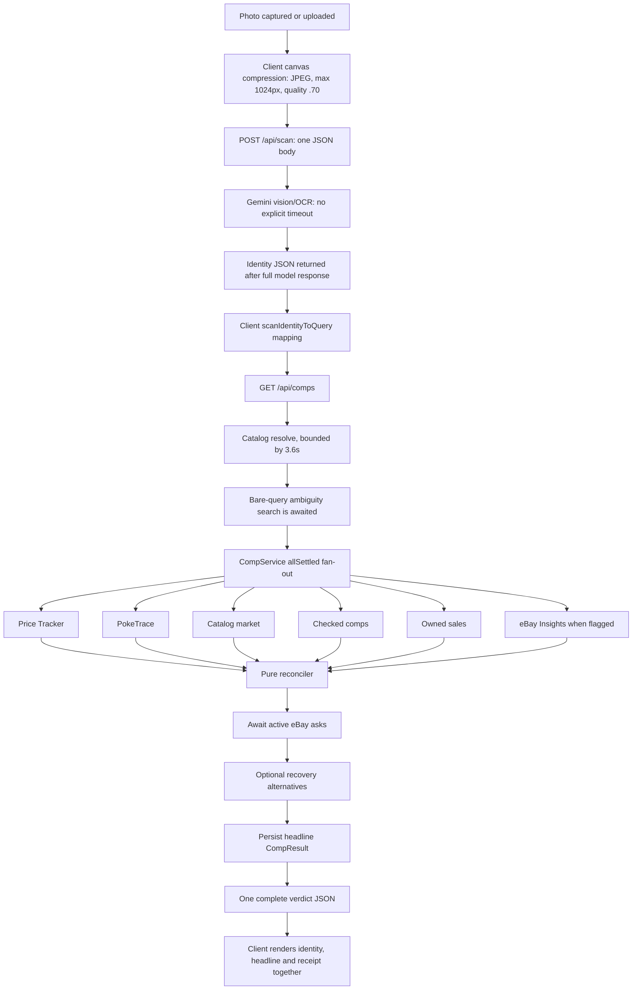

# Poke Deal architecture baseline

Captured on 2026-07-11 (Europe/London) from commit `9621e7b` before the full-pass overhaul. The worktree was clean when measurement began. This document is the Phase 0 paper trail; machine-readable figures live in [`docs/overhaul/BASELINE_METRICS.json`](docs/overhaul/BASELINE_METRICS.json).

## Executive baseline

The valuation core is healthy and well protected: 743/743 tests pass, the 10-scenario pricing attack suite has no failing verdicts, TypeScript and the production build are clean, and no configured secret value was found in client/static output. The main risks are delivery and operational shape, not price maths.

The measured critical path is approximately **11.6 seconds** for a successful photo-to-verdict run on the current local production build with live providers: Gemini identity extraction took 9.00–9.12s and an exact comp took 2.55s cold (1.78–2.09s warm). Identity and verdict are delivered as two monolithic JSON requests; no progressive contract exists.

The data layer has a concrete serverless footgun. The configured Neon hostname is not a pooler endpoint, and `getPrisma()` only caches the client outside production. A fresh production server therefore constructs new Prisma clients against an unpooled connection. Measured read latency was 0.79–0.94s for `/api/inventory` and 1.00–1.04s for `/api/dashboard`, including after warm-up.

The UI ships as one 10,979-line client orchestrator plus 7,638 lines of component CSS. The home route is 135kB / 222kB first-load JS. The five operational screens are client state, not URL-addressable routes; `/?view=...` links emitted by alerts and crons are currently ignored on first load.

## Component map

| Layer | Current implementation | Baseline judgement |
| --- | --- | --- |
| PWA shell | `src/app/page.tsx` owns navigation, server data, mutations, scan flow, comp flow, overlays and most workflow state. Inventory, Listings, Profit and Settings are dynamically imported; Today and the Buy surface remain in the root bundle. | Functional but tightly coupled. Route-level performance, deep links and isolated E2E setup are unnecessarily hard. |
| Styling | `tokens.css`, `base.css`, `screens.css`, and a 7,638-line `components.css`. | Extensive but accreted. Contrast and small-text failures are visible in Lighthouse. Existing franchise-styled assets conflict with the requested commercial identity. |
| Domain | Pure TypeScript under `src/lib`, with money in integer GBP pence. `cleaning.ts`, `reconciler.ts`, pricing, deal maths and dealer helpers are framework-free. | Strong. Preserve purity and pence boundaries. |
| Comp orchestration | `CompService` runs sources with `Promise.allSettled`, a 4s outer fallback and reconciliation after every source settles. `appCompLookup.ts` wires catalog, checked comps, owned sales and last-known cache. | Graceful but all-at-once. Outer timeouts do not abort underlying work. |
| Persistence | Prisma 5 / Postgres (Neon), 18 business models plus enums. | Schema is mature; connection reuse/pooling and a few query-aligned indexes need work. |
| Automation | Vercel daily and weekly crons, `CronRun` idempotency, in-app failure alerts, portfolio snapshots, watches, repricing and eBay order sync. | Idempotency exists. Cron failure delivery stops at the in-app inbox; it does not dispatch to Discord. |
| Integrations | Gemini, Pokémon TCG API, TCGdex, Price Tracker, PokeTrace, PSA, FX provider, eBay APIs, Vercel Blob and Discord. | Broad adapter coverage. Timeout/retry policy is inconsistent and several eBay/Discord/Gemini calls have no explicit budget. |

## Scan to verdict: actual data flow

Despite the comment in `/api/comps`, ambiguity work is not concurrent with the price lookup: the ambiguity promise is awaited before `compService.lookup()` begins. Identity, source progress and quorum verdicts are not progressively delivered.

## Route and handler inventory

There are two pages (`/` and `/privacy`), one generated manifest, 47 API route files and two scheduled cron entry points.

### Catalog, identity and valuation

| Route | Methods | Responsibility |
| --- | --- | --- |
| `/api/catalog/cards` | GET | Multi-source card typeahead. |
| `/api/catalog/search` | GET | Bundled/offline ranked card search. |
| `/api/catalog/sets` | GET | Bundled set catalogue. |
| `/api/scan` | POST | Gemini printed-identity extraction and scan telemetry. |
| `/api/psa/cert` | GET | PSA cert verification / fixture fallback. |
| `/api/comps` | GET | Catalog resolution, fan-out, reconciliation, asks, recovery and audit persistence. |
| `/api/comps/warm` | POST | Warm recent inventory comps. |
| `/api/checked-comps` | GET, POST | Dealer-entered sold evidence. |
| `/api/deal/grading-ev` | POST | Grading expected-value calculation. |

### Inventory, listings, sales and bookkeeping

| Route | Methods | Responsibility |
| --- | --- | --- |
| `/api/inventory` | GET, POST | Inventory list/create. |
| `/api/inventory/acquire` | POST | Atomic buy + optional listing intake. |
| `/api/inventory/[id]` | PATCH, DELETE | Item edit/delete. |
| `/api/inventory/[id]/sell` | POST | Atomic unit sale booking. |
| `/api/inventory/[id]/photos` | GET, POST, PATCH, DELETE | Photo metadata/order. |
| `/api/inventory/[id]/photos/upload-token` | POST | Scoped Vercel Blob client token. |
| `/api/listings` | GET, POST | Listing list/create. |
| `/api/listings/[id]` | PATCH | Listing lifecycle/edit. |
| `/api/sales/[id]` | DELETE | Undo booked sale. |
| `/api/expenses` | GET, POST | Expense ledger. |
| `/api/expenses/[id]` | PATCH, DELETE | Expense edit/delete. |
| `/api/dashboard` | GET | P&L, stale stock, sales and listing summaries. |
| `/api/deal-sessions` | GET, POST | Bundle session and line commands. |
| `/api/snapshots/portfolio` | GET, POST | Portfolio history/read and snapshot trigger. |
| `/api/backup` | GET | Portable ledger backup. |
| `/api/export/books` | GET | Sales/books CSV. |
| `/api/export/expenses` | GET | Expense CSV. |
| `/api/export/listings` | GET | Listing CSV. |
| `/api/export/listing-pack` | GET | Channel listing pack CSV. |

### Watches, alerts, health and automation

| Route | Methods | Responsibility |
| --- | --- | --- |
| `/api/watches` | GET, POST | Watch list/create. |
| `/api/watches/[id]` | PATCH, DELETE | Watch edit/pause/delete. |
| `/api/watches/check` | POST | On-demand target evaluation and optional delivery. |
| `/api/alerts/inbox` | GET, PATCH | In-app alert read state. |
| `/api/alerts/reprice` | POST | On-demand repricing run. |
| `/api/system/status` | GET | Lightweight configured/last-run status. |
| `/api/system/health` | GET | Deep external/DB health probes. |
| `/api/cron/daily` | GET | Idempotent snapshot, watch and eBay order jobs. |
| `/api/cron/weekly` | GET | Idempotent repricing job. |

### eBay

| Route | Methods | Responsibility |
| --- | --- | --- |
| `/api/ebay/connect` | GET | Seller OAuth entry. |
| `/api/ebay/oauth` | GET | OAuth callback compatibility path. |
| `/api/ebay/oauth/callback` | GET | OAuth callback and encrypted token storage. |
| `/api/ebay/status` | GET | Credential, identity, policy and readiness status. |
| `/api/ebay/location` | POST | Inventory-location creation. |
| `/api/ebay/orders/sync` | GET, POST | Sync preview/execute for paid orders. |
| `/api/ebay/account-deletion` | GET, POST | eBay marketplace deletion notification contract. |
| `/api/listings/[id]/ebay/preflight` | GET | Recorded payload/readiness check. |
| `/api/listings/[id]/ebay/offer` | POST | Inventory item + offer creation. |
| `/api/listings/[id]/ebay/publish` | POST | Sell/Trading API publish and local state transition. |

## Adapter and external-call inventory

| Adapter / call | Purpose | Explicit timeout | Retry / degradation behaviour |
| --- | --- | ---: | --- |
| Gemini `generateContent` | Printed card/slab identity | **None** | Maps 429 and upstream failures; route has an in-memory daily cap only. |
| Pokémon TCG API | Catalog identity, art and market signals | 6.5s adapter; 1.2s typeahead; 3.6s comp resolve | Catches and falls back to cache, TCGdex, bundled chase/promo data. |
| TCGdex | Secondary catalog identity/art | 6.5s adapter; 1.4s typeahead | Catches and degrades to other catalog sources. |
| Pokémon Price Tracker | Primary aggregate sold comps | 6.5s adapter, 4s CompService envelope | Several search variants; 350ms second-round delay for graded data; 24h in-memory raw-response cache. |
| PokeTrace | Regional cross-check | 2.2s per fetch, 4s CompService envelope | Up to 3 attempts for 429, shared throttle, market deny and cooldown state. |
| Catalog market source | TCGPlayer/Cardmarket baseline from catalog payload | Inherits catalog budget | Empty result on unavailable signal. |
| Checked comps / owned sales | Private evidence from Neon | No explicit query timeout | CompService catches failures into unavailable signals. |
| eBay Marketplace Insights | Restricted UK sold comps | 6.5s adapter, 4s envelope | Dark behind feature flag; empty result on failure. |
| eBay Browse | Live UK asks | Client implementation budget only; no route-level envelope | Budget/cache logic; ask evidence never changes reconciliation. |
| eBay Sell/Trading/Fulfillment/OAuth | Listing and order automation | No consistent explicit fetch timeout | Errors are surfaced; write paths use local DB transactions where applicable. |
| PSA Public API | Slab verification | 6s | Fixture mode without token; graceful error mapping. |
| FX provider | Currency rates | 4.5s | Neon daily cache, seven-day stale fallback, then visible static rates. |
| Discord webhook | Watch/reprice delivery | **None** | Throws on non-2xx; cron failures currently never invoke it. |
| Vercel Blob | Listing photos | SDK-controlled | Token path validates inventory scope and MIME policy. |
| Neon Postgres | Ledger and evidence | Prisma defaults | Configured URL is unpooled; production client is not globally reused. |

## Baseline metrics

| Gate / path | Baseline |
| --- | ---: |
| Test files discovered | 78 |
| Tests | 743 pass / 0 fail / 3.43s |
| Pricing red-team | 10 attacks, 0 `FAILS` / 0.27s runner |
| TypeScript | pass / 29.68s |
| Production build | pass / 18.00s |
| `/` route bundle | 135kB route, 222kB first load |
| Middleware bundle | 27.9kB |
| Exact comp, first request | 2.547s |
| Exact comp, subsequent range | 1.777–2.091s |
| Live scan success | 8.998–9.119s |
| Live scan upstream failure | 8.369s before 502 |
| Estimated successful scan→verdict | about 11.6s cold |
| Inventory API | 0.792–0.944s |
| Dashboard API | 1.004–1.039s |
| Lighthouse mobile, root/Buy | performance 74, accessibility 89, best practices 96 |
| Lighthouse FCP / LCP / TTI | 1.07s / 16.12s / 17.07s |
| Lighthouse font-size legibility | 58.56% |

Lighthouse 12 no longer emits a PWA category. The current project has a manifest and icons but no service-worker registration or IndexedDB queue. Because all operational surfaces are client-only tabs, separate route-level Lighthouse audits for Today/Stock/List/Profit are not reproducible without scripted user flows; the shared root audit and Playwright screenshots are the honest baseline.

Baseline screenshots are committed under `docs/overhaul/baseline/` for Buy, Today/Status, Inventory, Listings and P&L at 390×844.

## Risk and smell audit

### Confirmed, worth fixing

- Production Prisma clients are not reused, and the live URL is an unpooled Neon endpoint.
- The comp response is all-or-nothing. An ambiguity preflight serializes ahead of source fan-out, and the outer 4s timeout resolves a fallback without aborting slower adapter work.
- Gemini and Discord calls have no explicit timeout. Gemini budget enforcement is per-process and disappears on cold start; request size is checked only after JSON parsing/base64 allocation.
- Scan telemetry records the initial observation, but there is no correction endpoint/eval-set linkage.
- Cron idempotency and in-app failure alerts exist, but Discord is not dispatched for cron failures.
- No service worker, mutation queue, sync ledger or offline cached-verdict store exists.
- No dedicated manual-check queue exists; flags are only actionable inside the current Buy receipt/session.
- PriceSnapshot data powers portfolio history only; there is no per-card history route, stock-row sparkline or item chart.
- `/?view=...` deep links are emitted but ignored by `page.tsx` initialization.
- Today/Status exceeds the promised five-action brief and mixes daily actions, setup, launch readiness, inbox and command surfaces.
- Inventory and Profit queries are set-based (no obvious row-by-row N+1 in the view routes), but they overfetch overlapping graphs in separate initial requests. Listings lack an `itemId` index; inventory hot ordering/filtering would benefit from composite status/time indexes.
- Existing empty-state art, app icon and auth gate deliberately use franchise characters/trade dress, conflicting with the requested IP-safe commercial brand.
- Lighthouse flags insufficient contrast, disabled zoom (`maximumScale: 1`) and widespread small text.

### Checked and intact

- Money values stay integer GBP pence below adapters. Float arithmetic is used for rates/percentages and rounded at explicit boundaries; no stored-money float leak was found.
- `cleaning.ts` remains pure and framework-free.
- Comp sources degrade to empty/unavailable signals, and `Promise.allSettled` prevents one rejection from taking down the receipt.
- No configured secret value was found in `.next/static` or `public` assets.
- Inventory/dashboard data is fetched with relation includes rather than row-level client loops; no direct Stock/P&L N+1 was found.
- `CompResult(cardId, grade, asOf)`, `CheckedComp(cardId, grade, soldDate)` and `PriceSnapshot(cardId, grade, takenAt)` have useful history indexes.

## Phase 0 decisions carried forward

The six operating priors remain intact at baseline. The overhaul should improve delivery around the pricing core, not retune it without a measured failure. Any schema/auth/core one-way change must be recorded in `DECISIONS.md` before execution, with a migration/rollback path and guarding tests.

