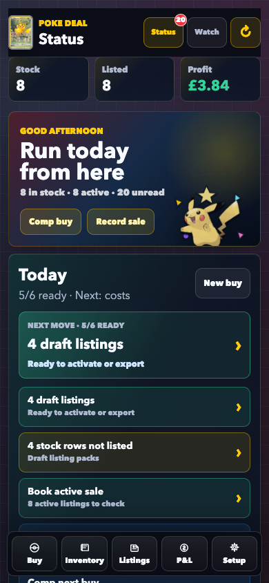
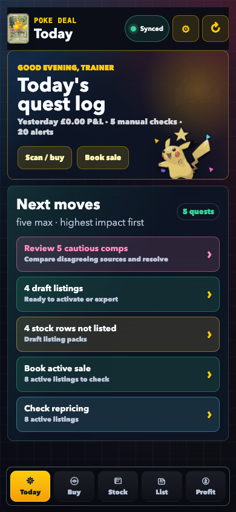
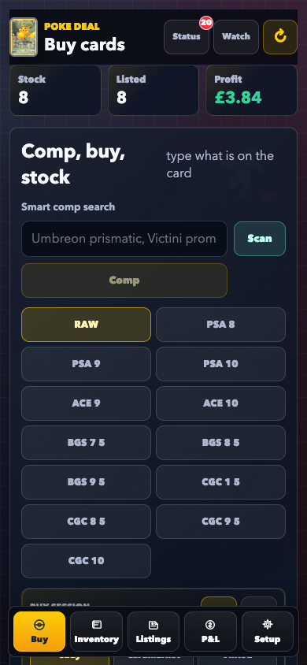
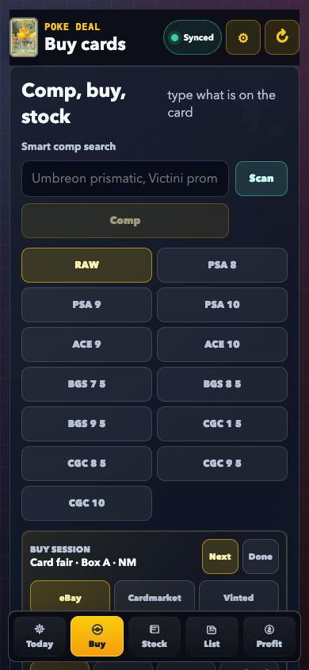
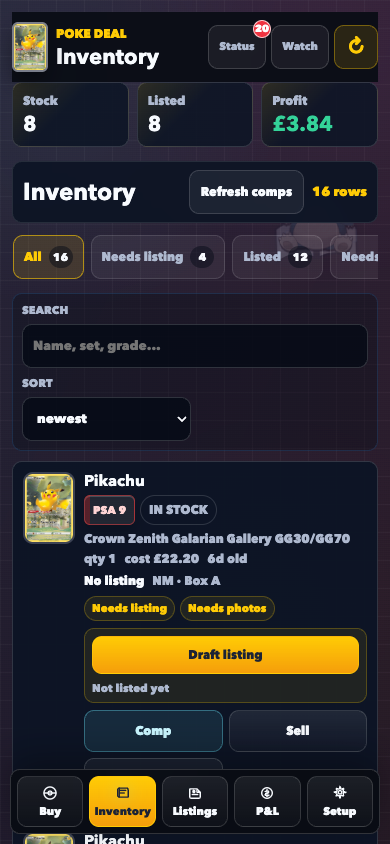
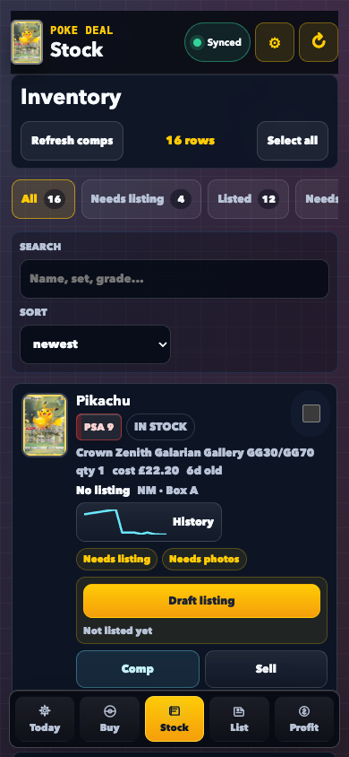
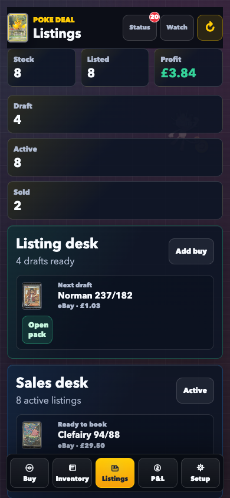
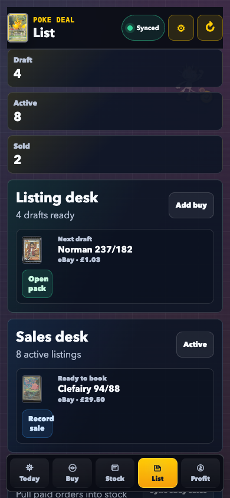
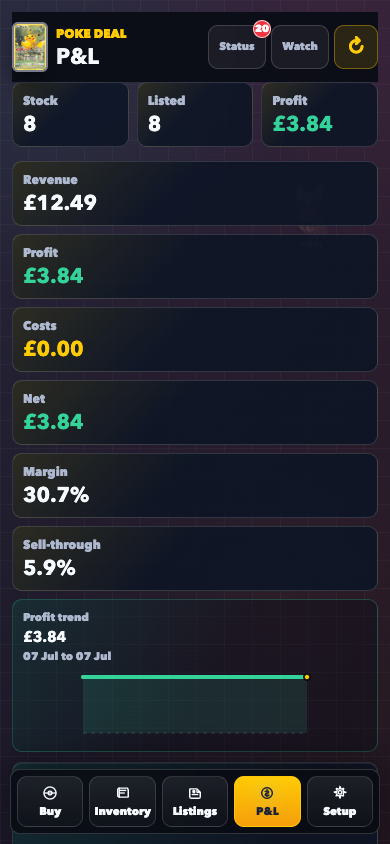
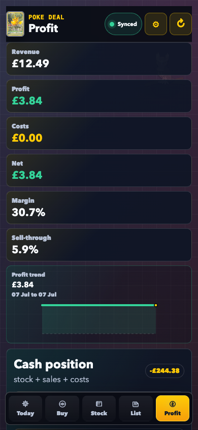

# Poke Deal full-pass overhaul report

Captured 11 July 2026 (Europe/London). Baseline measurements come from [`docs/overhaul/BASELINE_METRICS.json`](docs/overhaul/BASELINE_METRICS.json), taken from source commit `9621e7b` and committed as the Phase 0 evidence checkpoint `c4357fe`. Final machine-readable evidence is in [`docs/overhaul/FINAL_METRICS.json`](docs/overhaul/FINAL_METRICS.json).

## Owner verdict

Poke Deal is substantially better in the places that matter at a card table: the decision appears progressively instead of after one long blank wait; buys and sells survive loss of signal without duplicating money or stock; Today is an action list rather than a setup board; manual checks and price history are real workflows; listing copy cannot quietly turn an unsupported market number into “sold evidence”; and the app now looks intentionally, joyfully Pokémon.

The valuation brain was not retuned for the sake of the overhaul. Its pence boundary, cleaning/reconciliation purity, trust model and red-team protections remain intact. The pass changed how evidence arrives, persists and survives failure around that brain.

The measured result is meaningful but not perfect:

- The baseline photo-to-verdict estimate was 11.666 seconds. Combining the latest durable cold scan API probe with three live progressive receipt traces gives a final local span of about 5.964–6.888 seconds, roughly 41–49% faster. That is a derived span, not a statistically valid end-to-end p95.
- Compressed 512px scans retained 12/12 semantic identities in the evaluation set. A 42 KB payload on simulated fast 4G measured 1.342 seconds median and about 1.555 seconds p95 across three samples. The requested “identity under 1.5 seconds p95 on 4G” is therefore narrowly unproven, and this report does not round it into a pass.
- Today’s mobile Lighthouse LCP fell from 16.120 seconds to 3.178 seconds. Across the five final views, median performance is 95 and accessibility/best-practices are 100/100 throughout. Buy remains the slowest LCP at 5.304 seconds.
- All final local release gates are green: 786/786 full tests, 7/7 overhaul tests, 10/10 UX tests, 10 pricing attacks with zero failures, 4/4 Playwright flows, TypeScript, Prisma validation, production build, migration status, and a zero-vulnerability production dependency audit.
- One external exit criterion remains blocked: the notifier and cron-failure delivery code is implemented and tested, but no `DISCORD_WEBHOOK_URL` was supplied, so an actual Discord-channel fire is not proven.

In short: this is a release-worthy reliability and dealer-workflow improvement with two explicit follow-ups—live Discord proof and a larger physical-4G scan sample—not a claim that every aspirational target was met.

## Baseline versus final

| Measure | Baseline | Final | Honest reading |
|---|---:|---:|---|
| Full unit suite | 743/743 | 786/786 | 43 additional passing assertions; pricing attacks remain 10/10. |
| Browser coverage | None | 4/4 in 22.9 s | Real UI with deterministic fixtures; not a disposable seeded Postgres E2E. |
| Photo → terminal receipt | ~11.666 s estimated | ~5.964–6.888 s derived | About 41–49% faster; progressive stages are now visible. Not a p95 comparison. |
| 512px identity accuracy | Not measured | 12/12 semantic matches | Leading-zero collector segments are compared canonically. |
| Identity, simulated fast 4G | Not measured | 1.342 s median / ~1.555 s p95 | Very close; strict <1.5 s p95 is not proven. |
| Progressive comp after identity | No stream | catalog 2.755–3.658 s; quorum 3.362–4.509 s; receipt 3.585–4.509 s | Three live local production-build traces. |
| Inventory API | 0.792–0.944 s | 0.843–0.916 s warm | Comparable, not a claimed win. |
| Dashboard API | 1.004–1.039 s | 0.573–0.599 s warm | About 43% lower midpoint latency. |
| Today mobile LCP | 16.120 s | 3.178 s | Roughly 80% lower. |
| Today mobile TTI | 17.073 s | 6.919 s | Roughly 59% lower. |
| Lighthouse performance | 74 on baseline root | Today 93 · Buy 80 · Stock 95 · List 96 · Profit 95 | Every view is recorded; the median does not hide Buy. |
| Accessibility / best practices | 89 / 96 | 100 / 100 on every view | Five-view local production-build audit. |
| Build | 18.00 s | 16.72 s | About 7% faster. |
| Root / first-load JS | 135 / 222 kB | 145 / 247 kB | A real 7% / 11% growth cost for offline/progressive UI. |
| Production dependency audit | Not recorded | 0 vulnerabilities | Next 15.5.20, React 18.3.1, scoped PostCSS 8.5.16. |

The Lighthouse detail is deliberately preserved in the JSON evidence. Final FCP is tightly grouped at 1.059–1.080 seconds. LCP is 2.803–3.178 seconds on four views and 5.304 seconds on Buy. Total blocking time is 17–37 ms. Today has the largest measured layout shift at 0.0659, still below the usual 0.1 “good” boundary.

## What changed for the dealer

### Today is now a morning brief

The primary hierarchy is **Today · Buy · Stock · List · Profit**, with Setup and global actions moved out of the main operating loop. Deep links such as `?view=stock` now work on first load and update browser history. Today contains at most five prioritised actions: manual reviews, stale listings, repricing work, moved watches and a compact P&L line. Each action links directly to the place where it can be completed.

### Buy now leads with the decision

The decision hierarchy is “Pay up to £X” first, large **Just bought it / Watch / Pass** controls second, and the evidence receipt below. Identity, source arrivals, provisional/quorum verdict and terminal receipt render as separate states instead of one generic spinner. Every price-bearing state still carries sample, window/age, source and confidence context.

Gemini now uses the stable `gemini-3.1-flash-lite` model with minimal thinking, low image media resolution and a 512-token output cap. A separate 512px/quality-0.5 transmission derivative cuts the network payload while the better-quality photo remains available for the item. The final image-transmission dimension behaviour has a dedicated regression test.

Collection buying also behaves more like a till: the session shows the remaining budget against the cash ceiling and offers **Use rounded offer** before allocating costs.

### Loss of signal no longer means loss of the deal

The PWA now has a service-worker shell, IndexedDB bootstrap/receipt cache and a visible device mutation queue. Acquire, Quick Fill, mark-sold, review resolution, scan correction and pending scan work can survive a network drop. Queue state is explicit—offline, pending, syncing or error—and a row can be retried or discarded.

For the dangerous money/quantity writes, replay safety is server-backed rather than an in-memory promise:

- Acquire and Quick Fill persist a unique client mutation ID with the created inventory row.
- Multi-unit sales persist the mutation ID plus deterministic unit index.
- A duplicate response-loss retry replays the committed result instead of creating another row.
- A sale locks its inventory row with parameterised `SELECT ... FOR UPDATE`, so two different valid commands cannot overwrite the same quantity.

The two Playwright network-loss cases disable the connection mid-flow, reload offline, reconnect, flush once and verify the result in Stock. The limitation is equally explicit: a queued photo is replayed after reconnect, but there is no immediate offline pixel-fingerprint match. Typed identity and recently viewed cards can use cached receipts, always with cache age/stale treatment.

### Stock, List and Profit now close more of the loop

Stock search remains local and gains bulk listing/location/export actions, stale-stock cues and an eager 16-point sparkline preview. History previews are fetched with two queries total rather than one query per row. The full card history overlays market snapshots, acquisitions, listing prices and sold outcomes, all in GBP pence.

List remembers per-channel preferences and produces channel-specific eBay, Cardmarket, Vinted and in-person packs. A description may say “recent sold evidence” only when median, sample size, window, as-of date and explicitly sold-based source are all present. If any field is incomplete, the entire claim is omitted; there is no fallback to a bare price. Saved listing prices remain exact in packs/CSV.

The fixture dealer-loop browser test covers comp → buy → Stock → draft → sell → Profit so those screens are verified as one operating loop, not only as isolated components.

### Manual review and price history are first-class

Headline comp audits now persist confidence, manual-check reasons and the complete source receipt. Professor’s review lists unresolved items, shows disagreeing evidence and resolves “accept headline” in no more than two taps. Resolution metadata can change; original valuation evidence remains append-only.

`GET /api/cards/:id/price-history` provides the owned timeline used by Stock sparklines and the detailed history sheet. No paid backfill was introduced; snapshots continue accumulating forward.

The detailed tap audit and two-minute demonstration are in [`UX_REVIEW.md`](UX_REVIEW.md).

## What changed underneath

### Progressive, failure-bounded valuation

Legacy `GET /api/comps` remains compatible. New `GET /api/comps/stream` emits versioned NDJSON in a deterministic sequence: catalog, source updates, provisional/quorum verdicts, then one terminal receipt or error. A price is never sent alone. Slow remote work receives caller cancellation; Price Tracker, PokeTrace, Pokémon TCG market and eBay paths have explicit boundaries. Active eBay asks have a 3.5-second end-to-end budget and degrade to timestamped skipped evidence.

Receipt audit writes and scan-completion telemetry use Next’s post-response `after()` path where it is safe to do so. The budget reservation still completes durably before model spend, and valuation evidence is still returned before its audit write is deferred. This removed an observed occasional 5–9 second database tail from the user-visible terminal receipt without turning the write into an untracked promise.

### Serverless database reliability

One global Prisma client is reused per warm runtime. `DATABASE_URL` uses the Neon pooler while `DIRECT_URL` remains the direct migration connection. The additive migration adds only nullable/safe-default telemetry and review fields plus indexes aligned with real inventory, listing, comp, cron and scan queries.

Cron `RUNNING` is now a 15-minute lease. Fresh work stays single-flight; an abandoned run can be reclaimed with a conditional update rather than blocking that job forever. Cron failure claims are idempotent and reopen if delivery fails.

### Scan cost, safety and evaluation

The scan endpoint streams the request through a bounded JSON reader, caps decoded images, aborts Gemini on budget and reserves a daily/session allowance in Postgres under an advisory lock. A stable device-session header preserves fairness across retries; only an HMAC hash is stored. Scan events record latency, input size/kind and provider-reported usage. Corrections append linked evidence rather than overwriting the model’s original answer, creating a real eval corpus for future model changes.

The latest cold durable API probe took 2.379 seconds total, of which the model reported 998 ms, and confirmed `durable=true` for the reservation.

### Security and release engineering

The private single-user Basic-auth boundary remains, with a distinct cron bearer path and server-only provider credentials. eBay OAuth state is no longer predictable: it is random, HMAC-signed, browser-bound in a ten-minute HttpOnly/SameSite=Lax callback cookie and timing-safely checked before token exchange.

The framework moved off the vulnerable Next 14 line to the smallest audit-clean target used in this pass: Next 15.5.20 with React/React DOM 18.3.1, plus a scoped PostCSS 8.5.16 override. Dynamic route parameters were converted to Next 15’s asynchronous contract. This was intentionally not combined with React 19.

CI now boots disposable PostgreSQL, deploys the real migration set, then runs production dependency audit, Prisma validation, full unit tests, focused overhaul/UX suites, pricing red-team, TypeScript, production build and all Playwright flows in the `ship-gates` job. The repository workflow cannot itself prove that GitHub branch protection marks the job required; that is an external repository setting.

The architectural rationale, rollbacks and no-action decisions are in [`ARCHITECTURE_REVIEW.md`](ARCHITECTURE_REVIEW.md) and [`DECISIONS.md`](DECISIONS.md).

## Data safety and migration evidence

Before the schema change, the production ledger was exported to `output/backups/20260711-170314Z/poke-deal-backup-20260711-170314Z.json`:

- 18 tables
- 42,131 rows
- 24,453,944 bytes
- SHA-256 `b2709d4ca20aadd2279470af8487ef539e7f7c87b1b3a5df56a3687b15ab2b08`

The count includes 40,267 cards, 17 inventory items, 16 photos, 14 listings, 1 sale, 1 import, 26 checked comps, 1,602 comp audits, 88 price snapshots, 4 scan events, 28 cron runs, 36 FX rows, 6 watches, 4 alerts and 21 app alerts.

Migration `20260711120000_architecture_reliability` was applied to production. `prisma migrate status` reports up to date. The pre/post counts match exactly and the added columns are readable. No core inventory, sale, comp or scan row was rewritten.

The portable backup lives under ignored output rather than Git because it contains the private ledger. The hash above is the integrity check; do not publish the bundle.

## The six invariants: accounted for, not assumed

| Prior | Final status | Evidence that protects the original failure mode |
|---|---|---|
| GBP integer pence below adapters | Intact | Prisma/domain money fields remain integers; `currency.test.ts`, pricing/dealer tests and `PriceHistory.test.ts` assert pence conversion and overlays. No multi-currency ledger was introduced. |
| No bare-number comps | Strengthened | `progressContract.test.ts` rejects naked progressive prices; `clientProgress.test.ts` preserves complete receipts across chunks; `listingPack.test.ts` drops incomplete sold claims; the golden path asserts confidence evidence. |
| `cleaning.ts` stays pure | Intact | No DB/network/framework dependency was introduced. `cleaning.test.ts`, `reconciler.test.ts`, the full suite and all 10 pricing attacks run without IO. Reconciler weights were not retuned. |
| Sources degrade, never kill the lookup | Strengthened | `compService.test.ts` and adapter contract tests cover unavailable/timeout/cancelled sources; remote work is now actually aborted; progressive partial results and cached fallback remain usable. |
| Domain stays card-agnostic | Intact | Inventory, Listing and Sale still reference generic Card/grade domain records. New idempotency, history and listing-evidence code keys generic IDs; Pokémon-specific catalog/visual logic stays at adapters/UI. |
| Ship gates on every merge/release | Encoded and locally green | `.github/workflows/ci.yml` contains audit → Prisma → full/focused tests → red-team → typecheck → build → Playwright. Final local release rerun is green. Production `verify:prod` and the GitHub required-check setting remain external release evidence. |

No invariant was silently redefined. The one-way/additive choices—pooling/indexes, progress protocol, audit persistence, scan budgets, idempotency, locks/leases, OAuth state and framework security upgrade—each have rationale, rollback and guards in `DECISIONS.md` A1–A8.

## Pokémon-first visual system

The outside brief recommended removing franchise trade dress for a hypothetical commercial product. The owner explicitly overrode that direction: this is private, personal software and should feel fully Pokémon. The final identity therefore retains and amplifies Poké Balls, familiar characters, the red/yellow/blue franchise energy and the POKE DEAL name while keeping operational evidence legible.

The visual system separates brand colour from meaning. Confidence uses words, bar counts and patterns; Buy/Watch/Pass use different labels and silhouettes; freshness prints age/state; source mix has fixed shapes. Dark and light palettes are authored separately, reduced motion collapses transitions, and the final five-view Lighthouse audit scores accessibility and best practices 100/100.

Versioned PWA icons, maskable icon, Apple icon, favicon, OG art and three workshop illustrations are under `public/brand/v2/`. Existing Pikachu, Snorlax, Meowth, Psyduck, Machop, Noctowl and Chansey art supplies the character layer. Asset provenance, prompts and usage rules are in [`BRAND.md`](BRAND.md).

Important scope warning: this is not an official or affiliated Pokémon product. The current name, Poké Ball motifs and character likenesses are appropriate only to the owner’s stated private/personal scope. Before making the app public, multi-user, paid, customer-facing or part of marketing, review and likely replace the franchise assets and naming with qualified IP advice.

## Before and after evidence

| Screen | Baseline, 390×844 | Final, 390×844 |
|---|---|---|
| Today |  |  |
| Buy |  |  |
| Stock |  |  |
| List |  |  |
| Profit |  |  |

The final desktop Today view is also captured at [1440×900](docs/overhaul/final/desktop-today-1440x900.png). Mobile screenshots were pixel-inspected for overlap, clipping and bottom-navigation collisions. Dark mode, representative light-mode screens and reduced-motion behaviour were rechecked after the final CSS changes.

## Exit-criteria truth table

| Exit criterion | Result | Evidence / qualification |
|---|---|---|
| Scan → verdict measurably faster and progressive | Partial pass | Derived local span is 41–49% faster and progress streams. Simulated fast-4G identity p95 is ~1.555 s, so the strict <1.5 s condition is not yet proven. |
| Offline buy loop | Pass | Two network-loss Playwright cases, durable IDs and once-only replay. Immediate pixel-matched offline photo lookup is not included. |
| Golden path, contracts and red-team required gates | Local pass | 786 + 7 + 10 focused tests, 10/10 attacks and 4/4 browser flows. GitHub required-check enforcement is an external setting. |
| Discord for watches, repricing and cron failures | Code pass / live blocked | Bounded notifier and idempotent cron-failure delivery are tested. Missing webhook secret prevents a real-channel proof. |
| Manual review in no more than two taps | Pass | Dedicated worklist, reasons/evidence side by side and one-action accept after opening. |
| Per-card price history | Pass | Batched Stock previews and full owned-data overlay view. |
| Full brand system and screenshots | Pass | Tokens, assets, five mobile comparisons and desktop evidence. |
| eBay adapters ready behind gates | Pass at contract level | Marketplace Insights and Sell payload/preflight/publish adapters have fixtures; activation still needs approval, eligibility and live configuration. |
| Review, UX, brand, decisions and final evidence complete | Pass | This report links the complete paper trail and machine snapshots. |

## Deliberately deferred, in priority order

1. **Prove Discord delivery.** Add `DISCORD_WEBHOOK_URL`, trigger a controlled test alert, then a controlled failed-cron path, and record the channel result. Until then the live-alert exit criterion is open.
2. **Complete release-side evidence.** At this report’s capture, the production database migration and production environment configuration (except Discord) are complete. The final application deploy/Basic-auth smoke, `verify:prod`, GitHub run and required-check setting must be recorded separately; [`FINAL_METRICS.json`](docs/overhaul/FINAL_METRICS.json) keeps those booleans false rather than assuming success.
3. **Validate scan latency on the real handset/network.** Run at least 30 representative cards on physical fast/poor 4G and report p50/p95, correction rate and total photo-to-quorum. The current three-sample simulated p95 is 55 ms over target and the end-to-end improvement is derived, so more precision would be false confidence.
4. **Trace Buy’s 5.304-second LCP.** It is dramatically better than the earlier provisional result and the decision can progress before the terminal receipt, but it is still the slowest final view. Profile the largest element and remote-data timing before changing code.
5. **Add a seeded Postgres browser lane.** CI now proves that every migration deploys to disposable PostgreSQL before the gates run. The current E2E tests still use the real UI with deterministic route fixtures, so they cannot expose ledger constraints or transaction behaviour that only a seeded database journey would exercise.
6. **Finish externally gated eBay work only when the contracts are available.** Marketplace Insights and Sell await approval/eligibility. Account-deletion POST remains intentionally Basic-blocked until eBay’s signed-notification requirements are implemented and tested; do not add a broad middleware bypass.
7. **Add offline photo fingerprint matching if field use justifies it.** The safe current behaviour queues scans and serves typed/recent stale-badged receipts. Pixel fingerprinting would improve instant dead-zone rescans but needs collision and privacy tests.
8. **Persist operational telemetry only when there is somewhere useful to operate it.** Source freshness is runtime-local and logs/CompResult reconstruct verdicts, but this is not a cross-deployment percentile warehouse.
9. **Expand generic idempotency only with queue scope.** It currently covers the offline money/quantity paths—acquire, Quick Fill and sell. A universal receipt table would add complexity without protecting another queued mutation today.
10. **Decompose the root client orchestrator after release stabilises.** `src/app/page.tsx` is 12,099 lines, up from the 10,979-line baseline because the offline/progressive coordination landed there. Extracting screen controllers is worthwhile maintenance work, but doing it inside the reliability release would enlarge the regression surface without improving the dealer outcome.

## Final assessment

The strongest pre-existing part of Poke Deal—the honest valuation core—survived intact. The weakest parts changed materially: the user sees evidence sooner, the app can be trusted through signal loss, mutable operations are durable and replay-safe, cron/scan/provider work has real boundaries, and the daily loop now fits the way one dealer actually works.

The paper trail also shows the costs: more client JavaScript, a still-large page orchestrator, one narrowly missed latency target, fixture-backed rather than database-backed E2E, and an unprovable Discord channel without its secret. Those are bounded follow-ups, not hidden caveats.

For the stated private Pokémon-dealer use, the overhaul earns its release. For any future public or commercial scope, the first architecture decision is not another feature—it is replacing/reviewing the Pokémon identity and moving from single-user Basic auth to managed per-user sessions and authorisation.
