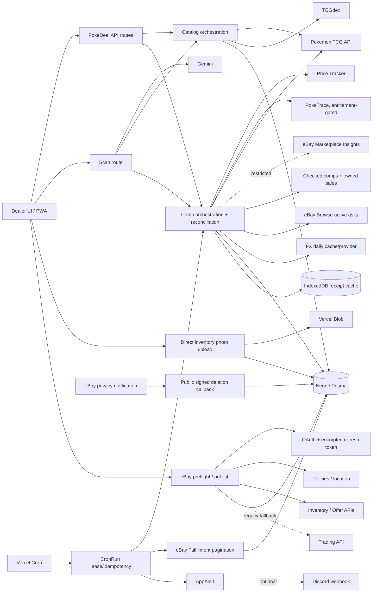

# PokeDeal API Audit, Repair, and Opportunity Report

**Audit date:** 2026-07-15
**Repository:** `/Users/jiddle/Desktop/Pokemon Dealer OS`
**Production validation mode:** read-only and non-destructive
**Official documentation access date:** 2026-07-15 unless a different date is stated

## 1. Executive verdict

PokeDeal has a real, operating integration spine, not a demo shell. Read-only production evidence showed live price data from Pokemon Price Tracker and PokeTrace, catalog data from Pokemon TCG API, GBP FX data, eBay Browse access, authenticated eBay Sell policy access, Neon persistence, Vercel Blob access, and recently successful crons. That evidence did **not** make the system fully trustworthy: the deployed comp path accepted a Base Set 2 card as Base Set, accepted magnet/non-English eBay asks, silently substituted fixture prices and a fake slab identity when credentials were absent, truncated eBay order imports to one page, retained unnecessary buyer-bearing provider payloads, and exposed an eBay deletion callback that the global Basic-auth gate prevented eBay from reaching.

The safe repository-owned defects reproduced during this goal are repaired locally with regression coverage. The most consequential before/after proof is the Base Set Charizard lookup: production selected the wrong Base Set 2 `004/130` Price Tracker record at **£209.01**; the repaired local adapter rejected the false match and selected Base Set `004/102`, returning a **£378.84** median from 98 provider observations. TCGdex now rejects direct-ID identity mismatches, active-ask filtering rejects magnets and non-English cards, missing credentials return explicit unavailable evidence, eBay orders paginate without partial imports, and account-deletion notifications are signature-verified and can scrub affected historical raw payloads.

The source tree is green after repair: **265 focused changed-area tests, 816 repository tests, 8 overhaul tests, 1 pricing red-team test, TypeScript, the 55-entry/51-API Next.js production build, the explicit demo, and `npm audit --omit=dev` all passed**. Production itself remains on the pre-repair code because this goal did not authorize deployment. Therefore the production defects preserved in the dated health/drift artifacts remain live until a separately approved release.

Six external decisions remain material:

1. Configure a strong Vercel production `APP_PASSWORD` before release. The deployed dealer UI and data APIs are currently public; the local fail-closed repair deliberately returns 503 in production if the secret is still missing.
2. Keep the documented operating context private and non-commercial. The owner explicitly confirmed that context on 2026-07-15, so the active PokeTrace and freecurrencyapi Free plans are not current licensing blockers; re-audit before any use-context change.
3. Rotate the freecurrencyapi default key and update Vercel under explicit approval because the provider dashboard rendered it into transient browser-inspection output; no copy is retained in repository files or this report.
4. Resolve PSA's current HTTP 429/403 disagreement and confirm its account/quota state.
5. Approve remediation of the one historical eBay raw-order row whose payload still contains buyer/address field names; the production keyset's marketplace-account-deletion exemption itself is verified.
6. Confirm the Gemini key type/restrictions before Google's September 2026 Standard-key enforcement milestone.

## 2. Evidence and classification method

Primary states use the brief's definitions. The six evidence columns are deliberately independent:

- **I:** implemented in this repository.
- **C:** required configuration is present in the observed environment.
- **A:** authentication/entitlement was actually exercised, not inferred from a key.
- **V:** invoked by a real app or cron path.
- **L:** returned semantically valid live data in this audit.
- **U:** can influence dealer-visible UI, pricing, inventory, a listing, a sale, or an alert.
- `Y`, `N`, `P`, `?`, and `—` mean yes, no, partial, unknown, and not applicable.

The evidence hierarchy was: current official contract; local contract/unit tests; safe direct live probe; dated deployed health/verification artifact; configuration presence; code presence. A key, a stored token, or HTTP 200 alone was never treated as live success.

## 3. Complete external integration scorecard

| Integration | Primary state | I | C | A | V | L | U | Evidence-based verdict |
|---|---|---:|---:|---:|---:|---:|---:|---|
| Pokemon Price Tracker v2 | **Fixed this goal; commercial API tier verified** | Y | Y | Y | Y | Y | Y | Live PSA10 health sample; deployed identity false-positive reproduced; strict set/number matching and no-key honesty repaired. Active key returned 19,682 daily credits remaining; Business-only population correctly returned 403. |
| PokeTrace | **Working for declared private use** | Y | Y | Y | Y | Y | Y | `/v1/auth/info` proved the active key is Free, active, 204/250 remaining. The owner explicitly declared private, non-commercial use, which fits the plan; US/raw-only and quota limits remain. |
| Pokemon TCG API v2 | **Fixed this goal** | Y | Y | Y | Y | Y | Y | Exact Base `base1-4` and ten price signals proved live; cancellation and cold-FX latency were repaired. |
| TCGdex REST | **Fixed this goal** | Y | — | — | Y | Y | Y | Public `base1-4` resolution proved live; direct-ID mismatch acceptance was repaired. |
| ScryDex image URLs | **Fixed this goal (removed)** | N | — | — | N | N | N | The repository constructed undocumented URLs contrary to the provider's documented rule. All non-fixture constructed URLs were removed; no live dependency remains. |
| TCGPlayer data | **Partial, transitive** | P | — | — | Y | Y | Y | Prices arrive inside Pokemon TCG/PokeTrace payloads. PokeDeal does not directly authenticate to or call TCGPlayer. New direct API access is not generally offered. |
| Cardmarket data | **Partial, transitive** | P | — | — | Y | Y | Y | Prices arrive inside Pokemon TCG/PokeTrace payloads. PokeDeal does not directly call Cardmarket; new API access is not currently offered. |
| PSA Public API | **Working in production; local network blocked** | Y | Y | Y in production | Y | Y in production | Y | A fresh production cert lookup on 2026-07-16 returned `found:true`, `live:true` and was not cached. The same endpoint from the local Mac returned a Cloudflare HTML 403 before token validation, and Chrome was blocked before sign-in. No credential change is indicated. |
| Gemini Generative Language API | **Partial** | Y | Y | Y | Y | P | Y | Model metadata for `gemini-3.1-flash-lite` returned 200 and advertised `generateContent`; no paid/content-generating production scan was triggered. Health/status and secret transport were repaired. |
| FX: freecurrencyapi/exchangeratesapi shape | **Working for declared private use; key rotation pending** | Y | Y in prod | Y | Y | Y | Y | Live GBP rates were observed. The dashboard proved 24/1,000 monthly requests used, a 10/minute limit and an August 3 renewal, matching the Free tier. Owner-declared private/non-commercial use fits that plan; secure header transport is repaired. |
| eBay OAuth/token store | **Partial** | Y | Y | Y | Y | Y | Y | Stored seller token authenticated policy reads. Production keyset scopes and RuName were dashboard-verified; the repository intentionally requests a smaller seller scope set, so unused app-level grants do not prove the current refresh token has them. |
| eBay Browse API | **Fixed this goal** | Y | Y | Y | Y | Y | Y | API reachability proved; misleading magnet/non-English asks were reproduced and filtered. Quota accounting remains per serverless isolate. |
| eBay Sell Inventory/Offer API | **Partial** | Y | Y | Y | Y | P | Y | Policy/read readiness proved. No listing/offer write was made, so create/update/publish effectiveness is unproven live. |
| eBay Account policies/locations | **Partial** | Y | Y | Y | Y | Y | Y | Production policies were ready; location creation is intentionally untested because it writes account state. Status calls need a durable/shared response cache. |
| eBay Fulfillment Orders | **Fixed this goal** | Y | Y | Y | Y | Y | Y | Recent cron succeeded. Multi-page retrieval, bounded no-partial failure, and minimal raw persistence were added and tested. |
| eBay Marketplace Insights | **Externally blocked** | Y | N | N | N | N | Y if enabled | Developer Analytics advertises a 5,000/day resource limit for the production keyset, but a safe application-token request returned 403 `Access denied`. The source remains disabled; a quota row is not entitlement. |
| eBay Developer Analytics | **Working as audit evidence; not integrated** | N | Y | Y | N | Y | N | A client-credentials read returned production keyset limits/remaining calls. It is a strong entitlement/quota diagnostic and an implementation opportunity, not an app runtime dependency. |
| eBay Trading GetUser | **Partial/legacy** | Y | Y | Y | Y | P | Y | Conditional readiness path exists; timeout added. XML regex parsing and live response semantics were not independently proven. |
| eBay Trading AddFixedPriceItem | **Fixed this goal/legacy** | Y | Y | Y | conditional | N | Y | REST fallback only. Fake Glasgow/G14 9QL defaults were removed; real configured seller location is now required. No marketplace write was performed. |
| eBay Trading VerifyAddFixedPriceItem | **Dormant/legacy** | Y | Y | ? | N | N | N | Code-only capability with no route/caller. Retain only if a sandbox verification workflow is intentionally built. |
| eBay marketplace account deletion | **Production exempt; defense fixed this goal** | Y | Y | — | N | — | compliance | Dashboard shows the production keyset is exempt under its vendor/legal-agreement reason, so callback delivery is not the active compliance path. Public challenge/ECC verification/idempotent scrub remain implemented and tested as defense if that state changes. |
| Discord webhook | **Implemented, not configured** | Y | N in prod | N | N | N | Y if enabled | Vercel environment-name audit proved no production Discord/legacy alert webhook. Delivery code now uses `wait=true`, requires a message ID, blocks mentions, and retries one 429. No nuisance message was sent. |
| Vercel Blob | **Fixed this goal** | Y | Y | Y | Y | Y | Y | Production blob read was sampled. Managed inventory blob deletion is now coupled to photo/item deletion; external catalog URLs are excluded. Upload/orphan reconciliation remains a future control. |
| Vercel hosting/runtime | **Fixed locally; production blocker** | Y | Y | Y | Y | Y | Y | Team is Hobby, runtime Node 24.x, latest five production deployments are READY and current Git HEAD is deployed. `APP_PASSWORD` is absent: unauthenticated root, dashboard metrics and 18 inventory rows were reachable. Production now fails closed locally when the variable is missing. |
| Neon Postgres + Prisma | **Working well** | Y | Y | Y | Y | Y | Y | Production query returned 18 inventory rows; DB is 24.1 MiB on Postgres 18.4 with 1/901 observed connections. Pooled runtime and direct migration URLs are distinct; plan/PITR/restore remain dashboard-blocked. |
| Vercel Cron | **Working well, with one gap** | Y | Y in prod | Y | Y | Y | Y | All four current runs succeeded with durable `CronRun` leases. Automation and interactive comp-source sets are not identical. |
| Manual eBay/Terapeak/Cardmarket/TCGPlayer/Vinted links | **Working well as links** | Y | — | browser | Y | browser | Y | These are operator handoffs, not authenticated API integrations and must never be labelled automated/live API proof. |

## 4. Internal API, cron, cache, persistence, and UI inventory

The production build contains 55 route entries: 51 API route files plus `/`, `/_not-found`, `/manifest.webmanifest` and `/privacy`. The complete API surface is grouped below without hiding individual paths.

| Surface | Routes/jobs | Persistence/cache | External dependencies | User-visible consumer and state |
|---|---|---|---|---|
| Catalog | `/api/catalog/cards`, `/search`, `/sets` | `Card`, set snapshot, provider in-memory caches | Pokemon TCG, TCGdex | Search/typeahead, identity, set art; **fixed this goal** for cancellation/provenance. |
| Comps | `/api/comps`, `/stream`, `/warm`, `/reviews`, `/api/checked-comps`, `/api/cards/[id]/price-history` | `CompResult`, checked comps, warm cache, source freshness, IndexedDB receipt | Price Tracker, PokeTrace, Pokemon TCG, optional MI, eBay Browse, FX | Buy receipt, headline, alternatives, confidence; **fixed this goal**, but deployed version still old. |
| Grading evidence | `/api/psa/cert` | no durable cert cache; cert result used in current request | PSA Public API | Slab identity/grade/population before comps; **fixed fixture semantics, externally blocked live**. |
| Inventory and ledger | `/api/inventory`, `/[id]`, `/acquire`, `/[id]/sell`, `/api/listings`, `/[id]`, `/api/sales/[id]`, `/api/expenses`, `/[id]`, `/api/deal-sessions`, `/api/deal/grading-ev`, `/api/dashboard` | Neon/Prisma ledger | Comp outputs; eBay on selected paths | Stock, margin, list/sell workflows; **working**, subject to upstream evidence quality. |
| Photos | `/api/inventory/[id]/photos`, `/upload-token` | `CardPhoto`, Vercel Blob | Blob, provider-returned catalog art | Listing/photo policy; **fixed this goal** for managed deletion and unsafe constructed image provenance. |
| eBay seller | `/api/ebay/connect`, `/oauth`, `/oauth/callback`, `/status`, `/location`, `/orders/sync`, `/api/listings/[id]/ebay/preflight`, `/offer`, `/publish` | encrypted credential record, listing IDs, `EbayOrderImport`, `Sale` | eBay OAuth, Account, Inventory, Fulfillment, Trading | Connect, preflight, publish, order sync; **partial** because writes were not live-tested. |
| eBay privacy | `/api/ebay/account-deletion` | historical `EbayOrderImport.payload` scrub | eBay Notification public-key endpoint | Compliance-only; **production exemption verified**, callback defense fixed locally. Read-only DB audit found one legacy raw row with buyer/address-bearing field names. |
| Scan | `/api/scan`, `/api/scan/corrections` | `ScanEvent` and correction feedback | Gemini, catalog, comps | Camera/image-to-comp; **partial**, model access but no live generation proof. |
| Watches/alerts | `/api/watches`, `/[id]`, `/check`, `/api/alerts/inbox`, `/reprice` | `PriceWatch`, `AppAlert`, freshness | Comp providers, optional Discord | Inbox, repricing and sourcing alerts; **partial** because external delivery is unproven. |
| Automation | `/api/cron/daily` at 07:30 UTC runs portfolio snapshot, buy-watch check and eBay order sync; `/api/cron/weekly` at 07:45 UTC Monday runs stock-health repricing | `CronRun`, snapshots, watch/reprice/order-import records | Comp providers, eBay, Discord | Four named background jobs; **all four latest runs succeeded**, source-set consistency gap remains. |
| Portfolio | `/api/snapshots/portfolio` | `PortfolioSnapshot` | Comp service | Valuation history; **working**, inherits provider/automation source differences. |
| Backup/export | `/api/backup`, `/api/export/books`, `/expenses`, `/listing-pack`, `/listings` | read-only ledger serialization | Neon; intentionally no reusable OAuth secrets | Books, recovery, listing handoff; **working**. Historical raw order payloads require approved privacy review. |
| System diagnostics | `/api/system/health`, `/api/system/status` | freshness, cron and DB evidence | all selected probes | Setup/readiness UI; **fixed this goal** to separate configured from live and include TCGdex/Gemini/eBay/Blob/deletion. |
| Offline client | PWA shell + IndexedDB workspace/comp cache | browser IndexedDB; comp receipt max age 7d | previously fetched app data | Offline inventory and receipts; **needs attention** because workspace bootstrap can render indefinitely stale non-comp state. |

Exact route-file inventory (51):

```text
/api/alerts/inbox                     /api/alerts/reprice
/api/backup                           /api/cards/[id]/price-history
/api/catalog/cards                    /api/catalog/search
/api/catalog/sets                     /api/checked-comps
/api/comps                            /api/comps/reviews
/api/comps/stream                     /api/comps/warm
/api/cron/daily                       /api/cron/weekly
/api/dashboard                        /api/deal-sessions
/api/deal/grading-ev                  /api/ebay/account-deletion
/api/ebay/connect                     /api/ebay/location
/api/ebay/oauth                       /api/ebay/oauth/callback
/api/ebay/orders/sync                 /api/ebay/status
/api/expenses                         /api/expenses/[id]
/api/export/books                     /api/export/expenses
/api/export/listing-pack              /api/export/listings
/api/inventory                        /api/inventory/acquire
/api/inventory/[id]                   /api/inventory/[id]/photos
/api/inventory/[id]/photos/upload-token
/api/inventory/[id]/sell              /api/listings
/api/listings/[id]                    /api/listings/[id]/ebay/offer
/api/listings/[id]/ebay/preflight     /api/listings/[id]/ebay/publish
/api/psa/cert                         /api/sales/[id]
/api/scan                             /api/scan/corrections
/api/snapshots/portfolio              /api/system/health
/api/system/status                    /api/watches
/api/watches/[id]                     /api/watches/check
```

### Internal control findings

- Global Basic authentication protects the app only when `APP_PASSWORD` is configured; production currently lacks it and is public. The local repair now fails closed in production if it remains absent. Authorized cron requests use their own secret. The eBay deletion callback is the only intentionally public eBay path and performs provider challenge/signature validation itself.
- `CronRun` and eBay import keys provide durable idempotency. Per-instance eBay Browse counters, OAuth access-token caches, provider request caches, PokeTrace cooldowns, and some freshness state do **not** provide global serverless quota control.
- Comp receipts expire after seven days. FX uses a daily durable cache and may use a visibly labelled cache up to seven days old before static development rates. Provider caches must never turn failure into unlabeled live evidence.
- Interactive comps include owned sales and checked comps; `CompService.default()` automation paths do not all include the same evidence. This is a comparability gap, not a data fabrication issue.
- `cardmarketId` is persisted but unused in matching. Several provider price/history/population fields are discarded before a feature can use them.
- Backup intentionally omits reusable eBay credentials. Restore therefore requires seller reconnection, which is the correct security tradeoff.
- Vercel still targets the legacy `EBAY_REFRESH_TOKEN` and several production provider credentials at preview as well as production, despite the validated DB token path. This expands credential exposure and should be narrowed only after an approved target-by-target review; no credential was removed or re-scoped during this audit.

## 5. System data-flow map



Business outcomes are downstream of evidence: catalog identity determines the card; sold/market signals plus owned evidence determine a comp receipt; active asks inform listing position; ledger rows determine realized margin; Fulfillment closes stock; crons update watches, repricing, and portfolio snapshots. A bad identity or stale/unlicensed source can therefore affect buy, list, and portfolio decisions even when every HTTP call succeeds.

## 6. Detailed provider findings and official sources

### Pokemon Price Tracker

- Repository use: `GET /api/v2/cards` with `includeEbay=true`, explicit `limit=1`, language, set/search, history days; maps provider aggregates rather than inventing individual sales.
- Auth: bearer API key. Published tiers at audit time were Free 100/day and 60/min with 3-day history; API $9.99 20,000/day and 60/min with six-month history/commercial use; Business $99 200,000/day and 500/min; Enterprise $300 1,000,000/day and 1,000/min. A basic authenticated request consumed one credit and reported 19,683 remaining; a Business-only population request then returned 403 `Business subscription required` and 19,682 remaining. Together these safely identify the active key as the commercial API tier and prove population is not entitled.
- Correctness: production returned a valid response for the wrong Base Set 2 identity. The repaired match now compares canonical set ID/name plus collector number, including promo-prefix exceptions.
- Cost: `includeEbay` and requested limit affect credits, so `limit=1` is retained. The 24-hour adapter cache reduces repeat spend but is per process.
- Underused documented capabilities: price history, sealed products, set/card exports, population data, and title parsing.
- Sources: [API reference](https://www.pokemonpricetracker.com/api-reference), [pricing](https://www.pokemonpricetracker.com/pricing).

### PokeTrace

- Repository use: `/v1/cards` cross-checks PokeTrace market/grade aggregates. Default market is now US; EU is opt-in only for an entitled plan.
- Auth/plan: API key. Published Free is 250/day, one request per two seconds, US/raw only, and expressly personal/non-commercial. Pro is published at $19.99 with 10,000 requests, commercial use, US+EU, grades/history. Scale is published at $98 with 100,000 requests, websocket and sold-listing capability.
- Live evidence: deployed RAW comp returned 482 samples and £266.14 median in 3.027s. The first `/v1/auth/info` attempts were unusually slow, but a complete authenticated response proved the key is active on **Free**, with a 250/day limit, 204 remaining, and reset at 2026-07-16T00:00:00Z.
- Usage context: on 2026-07-15 the owner explicitly confirmed this is private, non-commercial use. That fits the published Free terms, so the configured key remains enabled with the documented US/raw-only limitations. Any commercial, client-facing, resale, or shared-business change requires a fresh licensing review before continued use.
- Resilience: throttle/cooldown is per instance; global quota control is still needed for reliable daily-limit enforcement.
- Sources: [docs](https://poketrace.com/docs), [authentication](https://poketrace.com/docs/authentication), [pricing](https://poketrace.com/pricing), [markets and tiers](https://poketrace.com/docs/markets-tiers), [history](https://poketrace.com/docs/price-history), [listings](https://poketrace.com/docs/listings), [websocket](https://poketrace.com/docs/websocket).

### Pokemon TCG API, TCGdex, TCGPlayer, Cardmarket, and ScryDex

- Pokemon TCG API v2 supplies catalog identity/art and transitive TCGPlayer/Cardmarket price signals. A key raises the documented allowance from 1,000/day and 30/min to 20,000/day; the current v2 migration is the relevant contract.
- Exact live probe resolved Base Set Charizard as `base1-4`, Base, `4/102`, with ten price signals. Production deep health took 9.071s, much longer than the old 3.6s catalog budget. The new 7.5s orchestration boundary aborts underlying work, and FX/catalog I/O begin concurrently.
- TCGdex is public/free with filtering, sorting, and pagination but no published quota/SLA. Live `base1-4` resolved correctly. Direct ID now returns `null` when the returned card conflicts with requested context.
- TCGPlayer and Cardmarket are data provenance inside upstream payloads, not direct integrations. TCGPlayer is not accepting general new API access; Cardmarket is not issuing new API access. Features must be designed around licensed upstream delivery or manual links, not hypothetical direct keys.
- ScryDex explicitly says clients must not assume/construct image paths. PokeDeal did so for promos/new sets. Those URLs were removed; only provider-returned art is trusted.
- Sources: Pokemon TCG [authentication](https://docs.pokemontcg.io/getting-started/authentication/), [rate limits](https://docs.pokemontcg.io/getting-started/rate-limits/), [card search](https://docs.pokemontcg.io/api-reference/cards/search-cards/), [card object](https://docs.pokemontcg.io/api-reference/cards/card-object/), [migration](https://docs.pokemontcg.io/getting-started/migration/); TCGdex [REST](https://tcgdex.dev/rest), [filtering/pagination](https://tcgdex.dev/de/rest/filtering-sorting-pagination), [market prices](https://tcgdex.dev/markets-prices); ScryDex [docs](https://scrydex.com/docs), [authentication](https://scrydex.com/docs/getting-started/authentication), [rate limits](https://scrydex.com/docs/getting-started/rate-limits), [best practices](https://scrydex.com/docs/getting-started/best-practices); TCGPlayer [getting started](https://docs.tcgplayer.com/docs/getting-started), [announcements](https://docs.tcgplayer.com/docs/announcements); Cardmarket [API access notice](https://help.cardmarket.com/de/cardmarket-api), [API documentation](https://api.cardmarket.com/ws/documentation).

### eBay

- OAuth: authorization code/user token supports seller operations; client credentials/app token supports Browse, Developer Analytics and Notification public-key access. The repository stores an encrypted refresh token in Neon with an environment fallback and caches access tokens in process memory. The production RuName's accepted and declined URLs both target `/api/ebay/oauth`, which the repository supports.
- Scope evidence: the production keyset dashboard grants Authorization Code access to public, Marketing, Inventory, Account, Fulfillment, Analytics, Finances, payment disputes, Identity, Reputation, Notification, Stores, eDelivery, VeRO, Inventory Mapping, Message, Feedback and Shipping surfaces. Client Credentials exposes public plus feedback-readonly. PokeDeal currently requests only public, Inventory, Account and Fulfillment seller scopes; app-level availability is **not** evidence that the stored refresh token was consented for every broader surface. Adding scopes or reconnecting requires explicit approval.
- Browse: GB active asks are fetched with marketplace/category context and are user-visible. This is not sold evidence. The repair filters known accessory/magnet and non-English-language terms. One page is deliberate for latency/cost but quota accounting is not globally durable.
- Sell Inventory/Offers: inventory item, offer, publish, update, policy and location flows are implemented. Production policy reads authenticated; no write was made. Inventory API documented quotas are high, but availability does not prove seller registration, policy correctness, listing acceptance, or actual marketplace visibility.
- Fulfillment: order sync now follows `total/limit/offset` for up to 20 pages and throws before applying any partial page set if the bound is exceeded. Import keys and DB transactions protect replay. New raw payloads retain only normalized order/line fields, not the complete buyer/address-bearing response.
- Trading: GetUser and AddFixedPriceItem are compatibility paths. All now have bounded I/O. Publishing cannot invent a seller city/postcode. VerifyAddFixedPriceItem has no caller and is classified dormant.
- Marketplace Insights: code remains behind `EBAY_INSIGHTS_ENABLED`; access is restricted and not open to new users. The production Developer Analytics response reports a 5,000/day `buy.marketplaceinsight` resource with all 5,000 remaining, but a safe application-token query returned HTTP 403 / error 1100 `Access denied`. This is explicit non-entitlement evidence; the quota row alone does not authorize enabling the source. Because the former method reference now redirects and no successful live contract can be exercised, its single-page implementation is not expanded blindly.
- Account deletion: eBay requires either a reachable HTTPS challenge endpoint or an exemption. The production dashboard has **“Exempted from Marketplace Account Deletion”** selected with the vendor/contractual-legal-agreement reason. No callback endpoint/token change is required while that status remains valid. The callback defense is nevertheless now reachable through middleware, returns the documented SHA-256 challenge, fetches/caches eBay's public key, verifies ECC signatures, validates deletion topic/identifiers, scrubs exact historical identifiers, and returns 412 for invalid signatures.
- Historical privacy evidence: a read-only production query found one `EbayOrderImport` row, created 2026-07-08. It is a legacy/non-v1 payload and contains buyer/address-bearing **field names** including buyer, username, email, contact/tax/registration address, postal code and phone; no values were printed. Local repaired imports use minimal schema v1, but the old row and currently deployed pre-repair writer remain until separately approved purge/release.
- Application-specific quotas are now verified through a safe Developer Analytics call. Relevant production values were Browse 5,000/day (4,960 remaining), Marketplace Insights 5,000/day (5,000), Account 25,000/day (25,000), Fulfillment 100,000/day (99,999), Inventory 2,000,000/day (1,999,999), Notification 10,000/day (10,000), Trading generally 5,000/day (4,999), Finances 15,000/day (15,000), Analytics traffic reports 100/day, Taxonomy 5,000/day and Developer Analytics itself 5,000/day. Remaining is a point-in-time value, not a durable in-app counter.
- Sources: [OAuth guide](https://developer.ebay.com/develop/guides-v2/authorization), [Browse API](https://developer.ebay.com/develop/api/buy/browse_api), [Browse filters](https://developer.ebay.com/api-docs/buy/static/ref-buy-browse-filters.html), [marketplaces](https://developer.ebay.com/api-docs/buy/static/ref-marketplace-supported.html), [Inventory overview](https://developer.ebay.com/api-docs/sell/inventory/static/overview.html), [offers](https://developer.ebay.com/api-docs/sell/static/inventory/publishing-offers.html), [locations](https://developer.ebay.com/api-docs/sell/static/inventory/managing-inventory-locations.html), [Account](https://developer.ebay.com/api-docs/sell/account/static/overview.html), [Fulfillment](https://developer.ebay.com/develop/api/sell/fulfillment_api), [Developer Analytics](https://developer.ebay.com/develop/api/sell/developer_analytics_api), [Trading GetUser](https://developer.ebay.com/devzone/xml/docs/reference/ebay/GetUser.html), [data handling](https://developer.ebay.com/api-docs/static/data-handling-update.html), [call limits](https://developer.ebay.com/develop/get-started/api-call-limits), [deprecations](https://developer.ebay.com/develop/get-started/api-deprecation-status), [account deletion](https://developer.ebay.com/develop/guides-v2/marketplace-user-account-deletion), [Notification API](https://developer.ebay.com/develop/api/sell/notification_events), and eBay's [ECC notification SDK](https://github.com/eBay/event-notification-nodejs-sdk).

### PSA

- Repository use: cert-number lookup can correct slab identity before comps and show grade/population evidence.
- Live evidence: configured deployed request returned HTTP 429; a direct local-token request for the same safe health cert returned HTTP 403 in 501ms with no `Retry-After` or quota headers and no PSA envelope. The environments therefore disagree, but neither produced cert data. The response envelope, `IsValidRequest`, `ServerMessage`, and cert object must all be validated; success status alone is insufficient.
- Account-access evidence: opening the official Public API account page in controlled Chrome was blocked outright by PSA's Cloudflare policy, before sign-in. No password/MFA was requested or captured. Token/quota reconciliation therefore needs a normal-browser/manual account check or PSA support; automation must not attempt to bypass the block.
- Repair: missing tokens no longer make any numeric cert appear as an Umbreon VMAX PSA 10. Health/status no longer call that fixture availability.
- Limitation: PSA cert data is label/registry evidence, not physical slab authenticity proof. Current official pages do not publish a quota that can safely be encoded as a constant; the old unverified 100/day claim should not drive runtime policy.
- Sources: [PSA Public API](https://www.psacard.com/publicapi), [documentation](https://www.psacard.com/publicapi/documentation).

**2026-07-16 revalidation:** a fresh read-only call through the deployed `/api/psa/cert` route returned a real cert result with `found:true`, `live:true`, and `cached:false`. A simultaneous local direct call returned an HTML Cloudflare 403, and the PSA account page showed the same pre-login Cloudflare block in Chrome. This proves the production credential/integration currently works and that replacing the API token would not repair the local network block. The adapter now distinguishes this condition from rejected credentials and labels HTTP 429 rate limiting explicitly.

### Gemini

- Repository use: compressed image plus structured prompt to `models/{model}:generateContent`, parsed into scan identity candidates and persisted as scan evidence.
- Live evidence: model metadata for `gemini-3.1-flash-lite` returned 200, advertised `generateContent`, `countTokens`, `createCachedContent`, and batch generation; published limits include 1,048,576 input and 65,536 output tokens. This is auth/model-access proof, not OCR-quality proof.
- Repair: API key moved from query string to the documented `x-goog-api-key` header; status and deep health now expose configured versus live-model access.
- Current change risk: unrestricted Standard API keys are already rejected and all Standard keys are scheduled for rejection in September 2026. The dashboard key type/restrictions need verification. `generateContent` remains supported, while the newer Interactions API is Google's recommended unified path. Current stable model shutdown is not expected before 2027-05-07 according to the deprecation page at audit time.
- Sources: [model](https://ai.google.dev/gemini-api/docs/models/gemini-3.1-flash-lite), [deprecations](https://ai.google.dev/gemini-api/docs/deprecations), [pricing](https://ai.google.dev/gemini-api/docs/pricing), [rate limits](https://ai.google.dev/gemini-api/docs/rate-limits), [API keys](https://ai.google.dev/gemini-api/docs/api-key), [Interactions](https://ai.google.dev/gemini-api/docs/interactions-overview), [image understanding](https://ai.google.dev/gemini-api/docs/image-understanding), [structured output](https://ai.google.dev/gemini-api/docs/structured-output).

### FX

- Repository use: convert USD/EUR/JPY once at ingestion into integer GBP pence; persist daily quotes; allow a labelled cached quote up to seven days old; use static development fallback only when no durable/live quote exists.
- Production health proved freecurrencyapi live. Its current official authentication contract supports both the `apikey` request parameter and an `apikey` header, and explicitly recommends the header to avoid URL-log exposure. The repaired adapter now removes any `apikey` query value for freecurrencyapi hosts and sends the configured key only in the header. exchangeratesapi remains on its separate documented `access_key` query contract.
- Account/plan evidence: the authenticated dashboard showed 24 of 1,000 monthly requests used, a 10/minute limit, and renewal on 2026-08-03, alongside an upsell to the commercial premium service. Those account-specific limits exactly match freecurrencyapi's published Free tier, whose official page states that commercial use is not allowed.
- Usage context: on 2026-07-15 the owner explicitly confirmed private, non-commercial use, so the active Free account is permitted for the current deployment. A future commercial-use change would require a commercial provider/tier review; exchangeratesapi's Free tier also cannot use arbitrary GBP base without correct conversion math.
- Credential handling incident: the authenticated dashboard rendered its default key directly into the page, and the first broad DOM snapshot surfaced it in transient browser-tool output. The value was not copied into source, documentation, commands, or later probes and is not reproduced here. Rotation plus the corresponding Vercel update is recommended but remains an explicitly approval-gated credential change.
- Sources: freecurrencyapi [authentication and quotas](https://freecurrencyapi.com/docs/), [latest rates](https://freecurrencyapi.com/docs/latest), [zero-cost status endpoint](https://freecurrencyapi.com/docs/status), [plans](https://freecurrencyapi.com/); exchangeratesapi [documentation](https://exchangeratesapi.io/documentation/), [pricing](https://exchangeratesapi.io/pricing/).

### Discord, Vercel Blob/Cron, Neon, and Prisma

- Discord webhooks default to no response body when `wait=false`, so 2xx did not prove a saved message. PokeDeal now uses `wait=true`, requires an ID, sends `allowed_mentions.parse=[]`, retries a single documented 429, and bounds I/O. The production Vercel environment has neither `DISCORD_WEBHOOK_URL` nor the legacy alias, so delivery is not currently invoked; no live message was sent. Sources: [webhooks](https://docs.discord.com/developers/resources/webhook), [rate limits](https://docs.discord.com/developers/topics/rate-limits).
- Blob direct upload is implemented. The new deletion guard only accepts HTTPS `*.blob.vercel-storage.com/inventory/*`, so external catalog images cannot be deleted. Live read was sampled; write/delete was mocked. Sources: [Blob](https://vercel.com/docs/vercel-blob), [client upload](https://vercel.com/docs/vercel-blob/client-upload), [SDK](https://vercel.com/docs/vercel-blob/using-blob-sdk), [pricing](https://vercel.com/docs/vercel-blob/usage-and-pricing).
- Vercel account metadata was read through the already-authenticated CLI token without exposing it: Hobby plan, Next.js/Node 24.x project, and five of five sampled production deployments READY. The latest production deployment is from `main` and matches local Git HEAD; the audit repairs are uncommitted, so they are not deployed. The production environment exposes 29 variable records by name/target, including database, Blob, crons, eBay, FX, Gemini, Price Tracker, Pokemon TCG, PokeTrace, PSA, scan-budget and token-encryption configuration, but no `APP_PASSWORD`, Discord webhook, PokeTrace commercial-confirmation flag or FX commercial-confirmation flag.
- Public-access proof: unauthenticated `GET /` returned 200, `/api/dashboard` returned live metric groups, and `/api/inventory` returned 18 rows. No row values were printed. The code previously treated a missing password as “gate disabled” in every environment. It now allows that only in local development/preview and returns non-cacheable 503 in production, while preserving authorized crons and eBay's signed privacy callback. `APP_PASSWORD` must be configured before deploying this repair. Sources: Vercel [REST API authentication](https://vercel.com/docs/rest-api), [usage/plans](https://vercel.com/docs/pricing/manage-and-optimize-usage).
- Vercel Cron invoked all configured jobs recently. Durable DB leases prevent duplicate logical runs, but cron invocation and provider quotas are separate controls. Source: [Cron Jobs](https://vercel.com/docs/cron-jobs).
- Neon/Prisma are live. A safe SQL metadata query measured 24.1 MiB total database size, PostgreSQL 18.4, one active connection during the probe and a server-reported 901 maximum. Pooled `DATABASE_URL` and direct `DIRECT_URL` are appropriate. Plan, branching, PITR and restore evidence still require dashboard review. Prisma 5 is two major versions behind current Prisma 7 and needs a planned migration, not an opportunistic dependency bump. Sources: Neon [pooling](https://neon.com/docs/connect/connection-pooling), [pricing](https://neon.com/pricing); Prisma [Neon](https://docs.prisma.io/docs/orm/v6/overview/databases/neon), [connection management](https://www.prisma.io/docs/orm/v6/prisma-client/setup-and-configuration/databases-connections), [errors](https://www.prisma.io/docs/orm/reference/error-reference), [Prisma 7](https://www.prisma.io/blog/announcing-prisma-orm-7-0-0).

## 7. Repairs, root causes, changed files, and proof

| Repair | Root cause | Principal changed files | Before evidence | After proof |
|---|---|---|---|---|
| Strict Price Tracker identity | Search result was trusted without canonical set comparison | `pokemonPriceTracker.ts` + test | Base `4/102` selected Base Set 2 `004/130`, £209.01 | Live local-code probe selected Base `004/102`, 98 samples, £378.84; regressions pass. |
| Remove actionable fixtures | Adapters treated missing credentials as demo mode | `pokemonPriceTracker.ts`, `psaCert.ts`, routes/UI, `demo.ts`, README, tests | Any card/cert could receive generic prices/fake Umbreon identity | Missing key/token returns empty/unavailable; fixture only in explicit CLI demo/tests. |
| Catalog exactness and latency | TCGdex mismatch branch returned the mismatch; outer timeout did not abort; cold FX serialized | `tcgDex.ts`, `pokemonTcgApi.ts`, `appCompLookup.ts`, `CompSource.ts`, tests | Mismatched ID accepted; work continued beyond UI fallback; 9.071s production health | Direct mismatch returns null; abort propagates; FX starts concurrently; exact Base probe 1.281s. |
| Source timeout alignment | Orchestrator cancelled providers before their observed healthy response | `compService.ts`, `appCompLookupFlow.ts` | Price Tracker health 4.986s vs old 4s source timeout | 7.5s orchestration boundary remains above 6.5s adapter boundary; focused timeout tests pass. |
| eBay ask quality | Active listings were accepted without accessory/language exclusions | `browseAsks.ts` + test | Fridge magnet and Spanish card reached ask evidence | Same safe probe returned zero accepted misleading asks; exclusions are regression-tested. |
| Fulfillment completeness/privacy | Only first page fetched; full provider order/line persisted | `orders.ts` + tests | Daily limit 10 could omit orders; buyer/address-bearing JSON retained | Bounded 20-page iteration, no partial apply, and minimal schema-versioned raw fields. |
| Account deletion compliance | Basic auth blocked provider; POST blindly acknowledged; historical raw payload conflict | middleware, `callbackPath.ts`, `accountDeletion.ts`, route + tests | Provider could not challenge; unsigned POST got 204; claim contradicted storage | Public exact path, challenge, ECC/public-key verification, topic binding, exact scrub, 412/503 semantics. |
| Bounded eBay I/O | Most REST/OAuth/Trading calls had no timeout | `client.ts`, `oauth.ts`, `trading.ts`, tests | Hung provider could occupy route/function indefinitely | Shared 8s fetch boundary with caller cancellation; timeout regression passes. |
| Honest Trading location | Hidden fallback invented Glasgow/G14 9QL | `trading.ts` + tests | A real listing could carry false seller location | Publish fails until actual city/postcode are configured. |
| Blob lifecycle | DB photo/item deletion never deleted owned Blob | photo/item routes, `uploadPolicy.ts` + tests | Storage leaked after record deletion | Only managed inventory blobs are deleted; external URLs are left untouched. |
| Discord delivery proof | Generic URL accepted; default 2xx did not prove a saved message | `notifier.ts` + tests | False-positive delivery, uncontrolled mentions, no 429 handling | Discord URL validation, `wait=true`, ID proof, no mentions, one bounded retry. |
| Secret transport where documented | Gemini and freecurrencyapi keys were placed in query URLs | `cardScan.ts`, `deepHealth.ts`, `currency.ts` + tests | Keys could enter URL logs/traces | Gemini uses `x-goog-api-key`; freecurrencyapi uses its documented `apikey` header and strips the query key; exchangeratesapi keeps its distinct query contract. |
| Remove undocumented ScryDex construction | Code guessed asset paths instead of consuming returned URLs | catalog/promo/set files + tests | Invalid/unlicensed image paths could reach UI/listing | No non-fixture constructed ScryDex URL remains. |
| Diagnostic truthfulness | Status conflated configured, fixture, and working; omitted major providers | status route, `deepHealth.ts`, README/env | Green/setup text could claim fixture or key as readiness | TCGdex/Gemini/eBay/Blob/deletion included; no-key is unavailable; deep probes distinguish live. |
| Private production access | Missing `APP_PASSWORD` disabled middleware in every environment | `middleware.ts`, `appAccess.ts`, env contract + access-control tests | Unauthenticated deployed root/dashboard/inventory were HTTP 200; 18 inventory rows exposed | Local production-mode smoke returned non-cacheable 503 for all three paths; preview/dev remain usable; callback/authorized cron exemptions remain exact. |

The working tree contains 53 modified/new source implementation or test files, README and environment-contract changes, plus five audit/evidence documents. `git diff --check` is clean. No credential value is stored in source or documentation, committed, pushed, or deployed. One provider dashboard snapshot did surface the freecurrencyapi default key in transient browser-tool output; it is not reproduced or reused, and approved rotation is now a blocker.

### Preserved before evidence

- [HEALTH_CHECK_2026-07-15.md](./HEALTH_CHECK_2026-07-15.md): live provider/database/blob snapshot, including PSA 429.
- [CRON_HEALTH_2026-07-15.md](./CRON_HEALTH_2026-07-15.md): latest daily/weekly job state.
- [COMPS_DRIFT_2026-07-15.md](./COMPS_DRIFT_2026-07-15.md): deployed behavior changed in 24/29 cases, including severe bare-query mispricing and identity loss.

These artifacts describe the currently deployed pre-repair application. They are not rewritten as after evidence.

## 8. Remaining blockers and exact next actions

| Blocker | Consequence | Exact next action | Access/change class |
|---|---|---|---|
| Production `APP_PASSWORD` absent; live APIs are public | Inventory, costs, margin, sales and provider readiness can be read by unauthenticated internet users | Before release, create a strong production-only `APP_PASSWORD` directly in Vercel, redeploy/restart as required, then prove root/data APIs return 401 without Basic auth while authorized cron and eBay privacy callback behavior remain correct. Do not paste the secret into chat. | Urgent production setting/credential creation; explicit approval required. |
| Provider secrets and legacy eBay refresh token target previews | Preview deployments have broader reusable credential access than demonstrated necessary; DB and env refresh tokens duplicate exposure | Inventory each preview need, prove the DB seller token remains healthy, then request explicit approval to remove the legacy refresh-token env and narrow provider variables to production where previews do not need live accounts. | Credential target/removal changes require explicit approval and rollback plan. |
| Private/non-commercial usage assumption changes | Free-provider licensing would no longer fit if the app becomes commercial, client-facing, resold, or shared as a business system | Keep this report's owner declaration with the operating record. Before any use-context change, pause Free-provider calls and re-audit PokeTrace/FX terms, plans, markets, grades and credentials. | Current private-use declaration is sufficient; any account/plan/env change still requires explicit approval. |
| freecurrencyapi default key surfaced in transient dashboard inspection | Treat the key as exposed even though it is not retained in repository files or this report | With explicit approval, rotate the provider key, update the production Vercel secret directly without pasting it into chat, confirm the old key is revoked, and run one bounded read canary. | Credential rotation/revocation and production env change require explicit approval. |
| PSA returns 429 deployed / 403 locally; dashboard blocked by Cloudflare | Cert verification is unavailable; local and deployed credential states may differ | Inspect token status/usage in a normal browser or contact PSA support, then reconcile which token each environment uses. Do not bypass Cloudflare or rotate either token without explicit approval. | Manual inspection/support read-only; credential/env changes need approval. |
| Historical order payload privacy | The read-only audit proved one legacy row retains buyer/address-bearing fields; deployed pre-repair code can add more | After separately authorized release, repeat the count; then request destructive approval for a one-off purge of unnecessary payload content with backup/rollback and normalized-ledger preservation. | Audit completed read-only; purge remains destructive and unauthorized. |
| eBay seller writes unproven | Listing readiness is not marketplace effectiveness | After release, use sandbox contract tests; then obtain explicit approval for one controlled production listing canary if desired. | Sandbox may be account-modifying; production write explicitly prohibited here. |
| eBay MI denied despite quota row | No direct UK sold-listing API; enabling would turn known 403s into dealer-path failures | Keep disabled. Request eBay Business approval only if a real eligibility path exists; re-audit auth, method, pagination, quota and license before enabling. | External approval/entitlement plus later config approval. |
| Gemini key type/restrictions unknown | Standard key may fail by September 2026 | Read AI Studio key type, application restrictions and quota. If migration is needed, request approval before creating/rotating/restricting or updating env. | Inspection read-only; key/env changes need approval. |
| Neon/Vercel operational plan evidence missing | Restore window, PITR, Blob limits/cost not proven | Inspect Neon plan/branches/restore and Vercel Blob usage/retention without changing settings. Record a restore drill plan. | Read-only dashboard inspection; restore drill/settings need separate authorization. |
| Discord absent in production | External alerts are absent; in-app inbox remains the only delivery path | Decide whether external alerts are wanted. Creating a webhook/config and sending a test each require explicit approval because they change Discord/Vercel and create a notification. | Account/config modifying; test is externally visible. |
| Production remains old code | Reproduced defects remain user-visible | Review and deploy the local patch in a separate authorized release, then rerun health, production basket and drift as post-deploy canaries. | Deployment is account-modifying and was not authorized. |

## 9. Security, resilience, latency, cost, quota, quality, and observability

| Dimension | Current positive controls | Remaining risk and recommendation |
|---|---|---|
| Security/privacy | Local production fail-closed gate; cron secret path; encrypted DB eBay refresh token; secrets excluded from backup; Gemini/freecurrencyapi header auth; signed/bounded eBay deletion; verified production exemption; minimal new order payloads; managed Blob allowlist | Production remains publicly readable until `APP_PASSWORD` is configured and the patch is released. Preview-targeted provider secrets and the legacy env refresh token need approved scope reduction; the one counted legacy buyer-bearing payload needs approved purge. |
| Identity/data quality | Canonical set/number match; grade/variant/language cleaning; GBP pence boundary; evidence receipts; checked/owned evidence | Expand explicit language/variant coverage; use `cardmarketId`; preserve provider identity IDs; add seller/category false-positive basket; run deployed drift after release. |
| Freshness/cache | FX daily DB cache; comp warm cache with 7d maximum; evidence `asOf`; provider response caches | Provider caches/cooldowns are per instance; offline workspace lacks max age; expose actual age, expiry and provider update timestamp in UI. |
| Latency/cancellation | Adapter 6.5s, orchestrator 7.5s, eBay 8s; catalog abort; concurrent FX/catalog | Production PTCG was 9.071s and may still miss the user budget. Add latency histograms and stale-while-revalidate identity cache rather than extending interactive waits indefinitely. |
| Retry/failure | Sources return explicit empty/unavailable; Discord retries one 429; eBay order sync refuses partial page set | Implement provider-specific retry only for safe/idempotent reads with jitter and `Retry-After`; never retry listing publishes blindly. Preserve last-known evidence with visible age. |
| Quota/cost | Price Tracker `limit=1`; PokeTrace throttle; Browse local cap; deep health is explicit; MI disabled; eBay Developer Analytics provided exact app limits | Build a durable per-provider daily ledger and ingest eBay remaining/reset evidence. Health probes consume credits. Alert before 70/90% plan usage; dashboard-confirm non-eBay plans. |
| Idempotency | `CronRun` leases; order import keys; transaction boundaries; deletion scrub is repeatable | Add webhook notification ID ledger if more topics are subscribed; use outbox/reconciliation for Blob lifecycle and external notifications. |
| Observability | Structured source settlement logs; dated health/cron/drift artifacts; expanded status/deep health | Persist latency/status/quota outcomes across instances; distinguish configured/authenticated/live/user-visible in UI; add trace IDs from comp to provider receipt. |
| Dependency risk | `npm audit --omit=dev` zero known vulnerabilities | Prisma 5 to 7 is a planned migration; monitor Next/Vercel/eBay/Gemini deprecations, not just security advisories. |

## 10. Untapped capability-to-feature matrix

All proposals are tied to a PokeDeal dealer workflow and include a fallback. Cost is relative recurring provider/compute spend.

| Provider / documented capability | Current use / unused data | Proposed feature and dealer problem | Workflow/UI | Required build | Scope/plan dependency | Quality/fallback | Value | Effort / cost / risk / confidence / priority |
|---|---|---|---|---|---|---|---|---|
| Price Tracker history, population, exports | Current aggregate only; history/trend/pop largely discarded | **Liquidity and volatility receipt**: show velocity, dispersion, grade spread and recent trend to stop overpaying thin cards | Buy receipt; grading EV; portfolio | History tables, nightly job, `/price-history`, chart, anomaly rules | API plan/history window and credits | Keep provider/as-of/sample; fall back to current comp with “history unavailable” | Fewer bad buys; target lower write-down rate | M / $$ / medium / high / **Now-Next** |
| PokeTrace grades/history/markets/listings/websocket | Aggregate cross-check; richer Pro/Scale data unused | **Regional spread and sold-velocity monitor** for UK sourcing/repricing | Comp source drawer; watch creation | Market-normalized schema, entitlement-aware jobs, FX snapshot, alerts | Pro commercial for EU/grades; Scale for sold/WS | Disable by capability; never blend markets without label | More sourcing opportunities and faster repricing | M-L / $$ / licensing / medium / **Next** |
| Pokemon TCG + TCGdex identity/variants/languages | English identity/art and prices; IDs/cardmarket ID underused | **Identity confidence and variant picker** to prevent set/promo/language mistakes | Search/scan correction/preflight | Persist source IDs/language/variant, conflict score, refresh job | Public/keyed quotas | Two-source agreement; manual correction wins | Fewer wrong buys/listings/returns | M / $ / low / high / **Now** |
| PSA cert/population | Cert lookup only; live blocked | **Slab evidence panel and grade-pop scarcity input** | Buy graded; grading EV | Cert cache with TTL, quota ledger, mismatch warnings | Working PSA quota/token | Manual cert link when unavailable; never call registry proof “authentic” | Lower counterfeit/mislab risk, better grade decisions | S-M / $ / quota / high if access / **Now** |
| eBay Fulfillment + Finances | Orders imported; exact fees not ingested; keyset offers Finances but current token grant is unproven | **True contribution margin** using order fees, refunds and payouts | Sale detail; books; dashboard | Finances scopes/routes, fee/refund schema, reconciliation job | Explicit OAuth reconsent if current token lacks Finances | Estimated fee remains labelled until matched | Accurate profit and channel decisions | L / $ / privacy+scope / high / **Next** |
| eBay Inventory/Offers + Taxonomy/Media | Core publish implemented; policy/category details partly manual | **Listing quality preflight** with item specifics, photo diagnostics and category recommendations | Listing pack/preflight | Taxonomy/aspect cache, Media upload option, validation UI | Existing seller OAuth; quotas | Manual eBay listing link; block unknown required aspects | Higher sell-through, fewer rejected listings | M-L / $ / API drift / medium-high / **Next** |
| eBay Analytics + Developer Analytics | Developer Analytics proved quota reads; seller Analytics unused; keyset offers Analytics | **Seller performance and provider-budget dashboard**: impressions/clicks/conversion plus remaining/reset | Dashboard; listing detail; system status | Read-only ingestion, dimensional model, weekly aggregates, quota ledger | Explicit seller OAuth reconsent if needed; app token for Developer Analytics | Orders/views-only and documented static limits if unavailable | Improves listing choices and prevents quota exhaustion | M-L / $ / scope / medium-high / **Next** |
| eBay Negotiation/Marketing | Not used | **Offer-to-buyer and markdown suggestions** with margin floor | Reprice inbox | Eligibility read, margin guard, explicit operator approval | Additional APIs/scopes, marketplace rules | Suggest only; no automatic send | Faster stock turn without margin leakage | M / $ / customer-impact / medium / **Later** |
| eBay Notification API | Only deletion callback | **Order/listing event confirmation** to reduce polling latency and detect drift | Inbox/system status | Signed webhook ledger, topic processors, replay/idempotency | Dashboard subscriptions/callback approval | Fulfillment cron remains fallback | Faster stock closure; fewer oversells | M-L / $ / compliance / high / **Next** |
| Gemini structured vision and corrections | Single image scan; corrections stored | **Scan confidence loop**: front/back capture, quality gate, correction-derived prompt evaluation | Scan flow | Evaluation set, image quality metrics, versioned prompt/model, optional media resolution | Gemini quota/key policy | Manual identity picker; never auto-buy on low confidence | Faster intake with lower wrong-card rate | M / $-$$ / model drift / high / **Next** |
| FX historical endpoint / licensed provider | Latest daily quote only | **FX-at-evidence-time** and regional spread net of FX age | Comp details; books | Dated rate table, historical fetch/reconciliation, rate-age badge | Commercial plan with GBP semantics | Current daily rate labelled; no fake precision | Correct cross-market margin and books | S-M / $ / licensing / high / **Now** |
| Discord webhooks | Optional alert sink | **Delivery health and deduplicated actionable alerts** | System status; alert preferences | Delivery event/outbox, dedupe key, retry schedule, channel routing | Valid webhook; operator approval for test | In-app inbox remains source of truth | Fewer missed reprices without spam | S-M / $ / nuisance risk / high / **Next** |
| Neon/Blob operational capabilities | Primary persistence/photos | **Restore and orphan-reconciliation controls** | Admin/system | Backup restore drill, Blob inventory reconciliation, retention metrics | Plan/PITR/usage limits | Export plus manual recovery plan | Lower catastrophic loss/storage leakage | M / $$ / operational / high / **Now-Next** |
| Price Tracker sealed/title parse | Not used | **Sealed intake and listing-title parser** | Acquire/search | New sealed domain identity, parser adapter, confidence/manual review | Provider plan/credits | Manual catalog entry | Opens sealed inventory without polluting single-card comps | L / $$ / domain complexity / medium / **Later** |

## 11. Now / Next / Later roadmap

### Now — make repaired evidence safe to operate

1. Configure Vercel production `APP_PASSWORD` under explicit approval, then review and separately authorize deployment; unauthenticated access must close before functional canaries.
2. Operate PokeTrace and freecurrencyapi within their private-use Free limits, rotate the surfaced FX key under explicit approval, and re-audit both before any commercial-use change.
3. Preserve the verified eBay deletion exemption evidence; after release, repeat the privacy count and obtain separate approval to purge the one known legacy raw payload.
4. Resolve PSA 429/403 and add a durable quota view; confirm Gemini key type before September.
5. Add durable per-provider quota/latency/error evidence and surface freshness/entitlement in system status.
6. Establish Neon restore and Vercel Blob reconciliation evidence.

### Next — turn provider data into measurable dealer advantage

1. Price/liquidity/volatility history and regional spread receipts.
2. Identity confidence, variant/language correction, and catalog freshness jobs.
3. eBay signed order/listing notifications with Fulfillment polling fallback.
4. eBay Finances fee/refund reconciliation and true contribution margin.
5. Listing-quality preflight using taxonomy/aspects/photo evidence.
6. Scan evaluation loop and delivery outbox/deduplicated alerts.

### Later — expand only when access and measurement justify it

1. eBay Analytics, Negotiation and Marketing-assisted workflows.
2. PokeTrace Scale websocket/sold listings if incremental margin pays for the plan.
3. Price Tracker sealed inventory, export and title-parser workflows.
4. Direct or additional market providers only with obtainable, commercial API terms.
5. Planned Prisma 5→7 migration after compatibility/rollback work.

## 12. Implementation-ready backlog tickets

### API-NOW-01 — Release and post-deploy evidence canary

- **Acceptance criteria:** production `APP_PASSWORD` is configured directly in Vercel before release; unauthenticated root/dashboard/inventory return 401 after deployment; authorized cron and eBay privacy callback stay reachable under their own validation; all production health probes identify configured/authenticated/live states; Base `4/102` never resolves Base Set 2; ask fixture terms are excluded; production drift basket is recorded and no new severe identity regression appears.
- **Dependencies:** explicit password-setting approval and direct secret entry, release authorization, production environment, no unrelated provider credential changes.
- **Risks:** provider quota consumption; environment flags may intentionally disable PokeTrace.
- **Validation:** unauthenticated/authenticated HTTP matrix first; then run `health`, `verify:prod`, `health:cron`, `drift:comps`; archive dated output; compare source IDs, grades, markets, currency, sample, and age.

### API-NOW-02 — Provider entitlement and quota registry

- **Acceptance criteria:** DB-backed record per provider for plan, commercial-use status, daily/minute limits, reset, observed use, and verification date; eBay Developer Analytics limits/remaining/reset are ingested read-only; requests reserve/refund quota safely; status alerts at 70/90%; no per-isolate counter is presented as global.
- **Dependencies:** existing Price Tracker/PokeTrace/FX/eBay account evidence; remaining read-only PSA and Gemini account evidence.
- **Risks:** plan changes/drift; health probes themselves consume credits.
- **Validation:** concurrency tests across simulated instances, reset-boundary tests, 429/Retry-After tests, dashboard reconciliation.

### API-NOW-03 — PokeTrace Free-plan guardrails

- **Acceptance criteria:** current `/auth/info` evidence records Free/US/raw-only and the owner-declared private/non-commercial context; status shows plan/market coverage; any declared use-context change creates a stop-and-review action before further provider calls.
- **Dependencies:** continued private use; explicit approval for any plan/environment change.
- **Risks:** quota exhaustion, provider latency, silent change from private to commercial use.
- **Validation:** periodic read-only `/auth/info`, US/EU/grade fixtures, quota/cooldown tests, one deployed read canary after an authorized release.

### API-NOW-04 — FX key rotation and private-use safeguards

- **Acceptance criteria:** surfaced key is rotated under approval; replacement is entered directly into Vercel and the old key is revoked; private-use context and Free limits are recorded; key is handled by header without URL logging; daily/cache/static states are visible; any commercial-use change triggers provider migration review.
- **Dependencies:** credential-rotation and Vercel-setting approval; user enters the replacement directly.
- **Risks:** exposed key, inverted rates, stale fallback, accidental use-context change.
- **Validation:** old-key rejection, one bounded new-key read, known cross-rate vectors, seven-day stale boundary, workspace/log scan for key prefix/full URL absence.

### API-NOW-05 — eBay privacy completion

- **Acceptance criteria:** the verified production exemption and reason are recorded with a review date; local callback challenge/signature defenses stay green; after release the read-only audit shows only minimal schema-v1 payloads; separately approved purge changes the current legacy-risk count from one to zero without changing normalized sale/order ledger facts.
- **Dependencies:** release authorization; destructive DB approval for purge; backup/rollback decision. Any exemption/subscription change requires separate dashboard approval.
- **Risks:** compliance failure, over-deletion, callback spoofing.
- **Validation:** eBay dashboard read-only review, ECC vectors, invalid signature 412, duplicate event idempotency, before/after key-name-only DB audit, restore rehearsal.

### API-NOW-06 — PSA availability and evidence semantics

- **Acceptance criteria:** 429 cause documented; quota/use shown in status; cert cache respects provider freshness; mismatch and unavailable states never replace user identity silently; UI says registry evidence, not authenticity.
- **Dependencies:** PSA account dashboard/token status.
- **Risks:** unpublished quota, label ambiguity.
- **Validation:** official envelopes for success/not-found/invalid/429, cache expiry tests, one approved read-only cert probe.

### API-NOW-07 — Durable observability and freshness

- **Acceptance criteria:** each provider call records redacted trace ID, route/job, latency, outcome, quota cost, cache state, returned as-of and identity dimensions; no secrets/full sensitive payloads; dashboard distinguishes I/C/A/V/L/U.
- **Dependencies:** schema migration and retention policy.
- **Risks:** telemetry cost/PII/cardinality.
- **Validation:** log/redaction tests, sampling/retention test, cross-instance dashboard query, simulated timeout/429/stale result.

### API-NEXT-01 — Identity confidence and catalog freshness

- **Acceptance criteria:** source IDs, language, variant, set and number agreement produce a deterministic confidence score; conflicts require picker/correction; correction persists; catalog refresh is bounded/paginated and measured.
- **Dependencies:** Pokemon TCG/TCGdex contracts, schema fields, correction UI.
- **Risks:** reprints/promos/subsets and provider lag.
- **Validation:** modern/vintage/promo/subset/language/ambiguous basket; provider disagreement fixtures; no false exact match.

### API-NEXT-02 — Price history, liquidity and volatility receipt

- **Acceptance criteria:** history points keep provider/market/grade/currency/as-of/sample; UI reports velocity, dispersion, trend and source disagreement; minimum sample/age rules prevent false precision; provider unavailable state falls back visibly.
- **Dependencies:** entitled history endpoint/credits; historical FX.
- **Risks:** aggregate-vs-sale semantics, survivorship bias, quota cost.
- **Validation:** deterministic calculations, thin-market fixtures, conflict/outlier/stale tests, cohort measurement of avoided write-downs.

### API-NEXT-03 — eBay event-driven order confirmation

- **Acceptance criteria:** subscribed notifications are ECC-verified, notification IDs idempotent, normalized minimally, and reconcile to Fulfillment; polling remains recovery path; no event mutates inventory twice.
- **Dependencies:** eBay subscription approval/scopes; webhook event ledger.
- **Risks:** out-of-order/replayed events, privacy, dashboard configuration.
- **Validation:** official payload fixtures, replay/order tests, reconciliation gap metric, sandbox delivery.

### API-NEXT-04 — Exact eBay fees and refunds

- **Acceptance criteria:** Finances data maps fees/refunds/payouts to sale/order lines in integer pence; estimated vs settled margin is explicit; partial refunds and multi-line allocation reconcile to provider totals.
- **Dependencies:** Finances scope/account access, schema migration.
- **Risks:** financial-data access restrictions, timing, allocation.
- **Validation:** official fixtures, sum invariants, rounding tests, read-only account sample, books export reconciliation.

### API-NEXT-05 — External delivery outbox

- **Acceptance criteria:** AppAlert is source of truth; Discord delivery has dedupe key, attempt state, bounded retry/backoff and final failure; operator can disable/test with explicit action; no mentions by default.
- **Dependencies:** webhook configuration and notification approval.
- **Risks:** nuisance alerts and retry storms.
- **Validation:** 2xx/no-ID/429/5xx/timeout fixtures, duplicate job tests, one explicitly approved test message.

### API-NEXT-06 — Blob orphan reconciliation and restore drill

- **Acceptance criteria:** read-only job identifies DB-without-blob and managed-blob-without-DB cases; deletion is separately approved; Neon restore drill has RPO/RTO evidence; backup excludes secrets and validates row/photo references.
- **Dependencies:** Vercel/Neon plan access, retention policy, destructive-action gate.
- **Risks:** accidental deletion, provider listing references to photos, plan cost.
- **Validation:** isolated fixtures/store, dry-run report, restore to non-production branch, checksum/count reconciliation.

### API-LATER-01 — Planned Prisma 7 migration

- **Acceptance criteria:** official breaking changes inventoried; generated client/runtime/config updated on a branch; migration and rollback documented; query, transaction, build and production-like smoke gates pass.
- **Dependencies:** Node/runtime compatibility, Prisma 7 docs, database backup.
- **Risks:** driver/transaction/pooling behavior.
- **Validation:** full suite/build, schema diff, load/connection test, staging restore and rollback.

## 13. Commands and final verification

### Baseline before edits

```text
npm test                       PASS — 800 tests
npm run test:overhaul          PASS — 8 tests
npm run test:pricing-redteam   PASS — 1 test
npm run typecheck              PASS
npm run build                  PASS — 55 route entries (51 API); / 147 kB, 249 kB first load; middleware 35.5 kB
```

### Read-only deployed checks before repair

```text
npm run health                 completed; dated artifact written
npm run verify:prod            4/5; Base Charizard identity/ask failure preserved
npm run health:cron            completed; four recent jobs successful
npm run drift:comps            completed; 5/29 OK, 24/29 drift
```

Key observed details: Price Tracker 4.986s and live PSA10 sample; PokeTrace 3.027s and live RAW sample; Pokemon TCG API 9.071s with art; PSA HTTP 429; FX live; eBay Browse reachable; eBay Sell token/policies ready; MI disabled; Neon 18 rows; Blob sampled.

### Focused and final after repair

```text
node --import tsx --test <focused changed-area suites>   PASS — 265 tests
npm test                                                PASS — 816 tests
npm run test:overhaul                                   PASS — 8 tests
npm run test:pricing-redteam                            PASS — 1 test
npm run typecheck                                       PASS
npm run build                                           PASS — 55 route entries (51 API); / 147 kB, 249 kB first load; middleware 35.4 kB
npm run demo                                            PASS — explicit `demo-fixture`, `live:false`
npm audit --omit=dev --json                             PASS — 0 known vulnerabilities (56 production dependencies)
git diff --check                                        PASS
```

Safe live local-code proof after repair:

```text
Price Tracker Base identity: 5.210s, Base Set 004/102, 98 samples, £378.84 median
Price Tracker entitlement: basic HTTP 200; 19,682 credits remaining after Business-only population returned 403
TCGdex mismatched direct ID: rejected
Pokemon TCG exact identity: 1.281s, base1-4 / Base / 4/102, 10 price signals
eBay Browse filtered asks: 3.086s, 0 accepted misleading asks, source not skipped
eBay Developer Analytics: HTTP 200; app-specific quotas/remaining returned without exposing credentials
eBay Marketplace Insights entitlement: HTTP 403 / error 1100 Access denied with application token
eBay privacy DB audit: 1 row; 0 minimal-v1; 1 legacy row with buyer/address-bearing field names (values not printed)
Gemini model metadata: HTTP 200, generateContent advertised
PokeTrace auth/info: HTTP 200; active Free; 204/250 daily requests remaining; non-commercial
freecurrencyapi dashboard: active Free limits proven by 24/1,000 monthly use, 10/minute and 2026-08-03 renewal; owner declared private/non-commercial use
PSA direct local-token check: HTTP 403 in 501ms, no quota headers/envelope; deployed health had HTTP 429
Vercel account metadata: Hobby, Node 24.x, latest 5/5 production deployments READY; latest matches Git HEAD
Unauthenticated production: root 200; dashboard 200; inventory 200 with 18 rows; no values printed
Local fail-closed production smoke: root/dashboard/inventory HTTP 503 with Cache-Control no-store
```

No production write, listing, order mutation, Discord message, Blob upload/delete, credential change, plan change, deployment, commit, push, or destructive database operation was performed.

## 14. Explicit limitations and unproven claims

- The repaired code is **local only**. Production evidence is pre-repair until deployment is separately authorized.
- Production is currently publicly readable because `APP_PASSWORD` is absent. The fail-closed repair is not live; adding the secret is an urgent but explicitly approval-gated production credential change.
- A provider response used by health may differ from the dealer-facing route's latency, cache, identity, query, grade, market, and timeout. Health is evidence, not a blanket guarantee.
- Price Tracker's commercial API tier and point-in-time remaining credits were verified through provider response headers/feature gating; billing/retention and dashboard ownership were not inspected. PokeTrace's active Free plan and point-in-time daily use were verified; freecurrencyapi's active Free limits were dashboard-verified. Their current suitability depends on the owner's explicit private, non-commercial use declaration; no account plan was changed.
- PSA authentication is not proven: deployed health returned 429, the local configured token returned 403, and controlled dashboard access was blocked by Cloudflare; neither path returned a valid cert envelope.
- Gemini model metadata proved key/model access, not real scan quality, token cost, production key restrictions, or quota.
- eBay seller reads authenticated and the production keyset's available scopes/quotas were inspected. Inventory/offer/listing writes, actual marketplace visibility, location creation, current refresh-token grants for unused scopes, Finances, seller Analytics, Negotiation and new notifications were not proven.
- eBay account-deletion exemption is verified. A real signed delivery is inapplicable while exempt and was not generated. The one legacy buyer-bearing raw payload was counted without values but not purged because that is destructive.
- eBay Marketplace Insights is disabled and restricted. Developer Analytics exposes a nominal quota row, but an application-token request returned 403, so pagination/data semantics remain unavailable and unguessed.
- Discord delivery, Blob write/delete and Neon restore/PITR were not tested live because they create state or require dashboard access. Vercel plan/runtime/deployment metadata was verified read-only; detailed current-period Blob usage was not.
- TCGPlayer and Cardmarket are transitive provenance/manual destinations, not direct authenticated APIs.
- ScryDex is no longer a runtime dependency; captured historical regression fixtures may still contain its old URLs as immutable before evidence.
- Static FX is development/failure evidence, never live market proof. The production freecurrencyapi plan is confirmed Free and fits the declared private/non-commercial use; licensing must be re-audited before any use-context change.
- The post-repair direct eBay query returning zero accepted asks proves the observed misleading items were filtered, not that every future eBay result is semantically correct.
- Official documentation does not prove account-specific state. eBay keyset scopes, quotas and deletion exemption were separately verified through the logged-in production dashboard/API; the remaining provider-specific plan/entitlement claims still require their listed read-only account checks.

## Definition-of-done conclusion

Every discovered external integration, internal API group, cron, cache/persistence layer, and UI consumption path has been classified. Live, configured, authenticated, fixture, transitive, manual, and user-visible states are explicit. All safe reproducible repository defects found in active paths were repaired and tested, including the newly proven production fail-open gate and freecurrencyapi URL-secret transport. Provider licensing is classified against the owner's explicit private, non-commercial use declaration rather than inferred from dealer-oriented feature names. The remaining dark Marketplace Insights pagination is precisely deferred because the integration is disabled and a safe application-token call was denied; a nominal quota row must not be disguised as entitlement or used to guess a redirected contract. Larger cross-instance quota, observability, restore, privacy purge, and feature work is expressed as implementation-ready backlog. Final local tests/build are green. Production release, `APP_PASSWORD` creation, FX key rotation, destructive historical cleanup, and remaining provider account proofs are explicit external actions; the password must be resolved first because the currently deployed workspace is publicly readable.

---

## 15. Private-use dealer improvement implementation — 2026-07-16

This addendum is the final implementation record for the private-use improvement goal. It supersedes the earlier backlog status and verification counts where they conflict, while retaining sections 1–14 as the discovery, provider-documentation and before-evidence record. Work concerning authentication hardening, commercial licensing, deployment, production-only infrastructure, secret rotation, CI/CD and enterprise/public-release concerns was intentionally excluded.

### 15.1 Outcome

Every feasible repository-owned audit improvement that materially affects private dealer use has been implemented. The main dealer loop now preserves an exact physical-print identity, rejects unsupported or conflicting price evidence, explains which evidence won, remains responsive under overlapping requests, and distinguishes live, cached, stale, fixture and unavailable states. External/account-dependent opportunities remain explicit and are not presented as working features.

### 15.2 Implemented improvement inventory

| Area | Implemented change | Dealer-facing result | Regression evidence |
|---|---|---|---|
| Catalog identity | Added canonical physical-print merge across Pokémon TCG API, TCGdex and Cardmarket identities; deduplication retains provider IDs, images, price signals and provenance | The same print no longer appears as duplicate provider rows, while reprints/languages/finishes remain separate | `catalogIdentity.test.ts`, `cardSearch.test.ts`, `appCompLookup.test.ts` |
| Identity confidence | Added deterministic score, reasons, conflicts and `autoSelectable`; confidence now considers set, number, language, edition, finish and trusted provider IDs | Auto-selection is limited to defensible exact matches; ambiguity visibly requires confirmation | `identityConfidence.test.ts`, scan mapper tests |
| Print persistence | Added language/edition/finish and provider identities to card, deal-line, scan and inventory/acquisition paths, with a forward Prisma migration and collision-safe cache lookups | Corrected identity survives scan → comp → buy → stock instead of being lost between screens | schema/migration plus scan correction, cache and request tests |
| Language and variant matching | Added explicit English/Japanese routing, edition/finish parsing and enforcement, vintage confirmation rules, and unsupported-print manual handling | English evidence cannot be relabelled Japanese; generic market values cannot silently price 1st Edition, Shadowless, Staff, Prerelease or unsupported finishes | request, market-source, PokeTrace and scan tests |
| Provider result quality | Tightened Price Tracker, PokeTrace, catalog-market and eBay identity gates; eBay rejects wrong cards, non-cards, magnets, lots, sealed, damaged, reproduction, wrong language/grade/edition/finish results | Higher-quality evidence is preferred over a larger misleading result set; rejection counts are diagnostic | provider adapter and Browse ask tests |
| Reconciliation | Added source tier, market, sample, freshness, corroboration, penalties, spread and plain-language `chosenBecause` diagnostics | The headline price explains why it won; disagreement remains visible instead of being averaged away | `reconciler.test.ts` and red-team pricing suite |
| Price history intelligence | Preserved provider/market/grade/currency/as-of/sample/window/manual/availability per point; added liquidity, MAD-based volatility, 30/90-day trend, disagreement and minimum-evidence safeguards | History shows whether a card is liquid, volatile or thin and names the exact reason when a metric is unsafe | `priceHistory.test.ts`, component tests |
| Shared evidence path | Watch, reprice, warm-cache and portfolio runners now use the same app comp factory as interactive lookup, including catalog resolution, providers, checked comps, owned sales and durable cache | Background suggestions no longer use a weaker or differently matched pricing path | full suite and runner tests |
| Progressive lookup | Enforced one active comp request, stale-event request IDs, abort/release handling, explicit cancel, provisional-action disabling and silent supersession | Rapid card changes cannot overwrite the current receipt; the dealer can cancel; incomplete evidence cannot be actioned as final | `clientProgress.test.ts`, browser golden path |
| Search responsiveness | Added abort/stale-response guards, normalized 60-second typeahead cache, parallel local searches, retained prior results during refresh and `aria-busy` | Search feels immediate, avoids flicker and does not show late results for the previous query | catalog/search tests and browser dealer loop |
| Request efficiency | Bundled set metadata/popular sets in one call; changed unresolved TCGdex lookup from per-set detail fan-out to one brief set index; collapsed common post-acquisition refreshes to one dashboard read; made refresh single-flight | Fewer requests and shorter waits without reducing evidence quality | TCGdex request-count test, build and browser dealer loop |
| Safe resilience | Added abort-aware, idempotent-GET-only retry handling with one bounded retry and `Retry-After` support to Pokémon TCG API, TCGdex, PSA, Price Tracker and FX | Transient read failures get one safe recovery attempt; cancellation and non-retriable failures stop immediately | `fetchReadWithRetry.test.ts` plus provider suites |
| Cache truthfulness | Partitioned comp cache by language/edition/finish/provider identity; capped offline workspace bootstrap at seven days; preserved partial refresh success; exposed origin, cache age and stale state | Cached data cannot cross-contaminate prints and is never described as live; old workspace state expires | offline policy/key tests and pricing semantics browser tests |
| Provider cache policy | Added explicit live/cached metadata; PSA success caches 1h, not-found 5m and never caches auth/rate/transient failures; Price Tracker cache is labelled | Fast repeat reads do not disguise old or failed evidence as a fresh provider success | PSA and Price Tracker tests |
| Dealer UI provenance | Price and catalog views now show source, market, sample, window, freshness, identity/variant/language, confidence, disagreement and selection rationale; stale comps instruct refresh | The dealer can judge a number rather than trust an unexplained headline | component tests and browser pricing semantics |
| Health and diagnostics | Settings distinguishes configured from live, records last check/age/latency/detail/failure and supports an explicit live check; status includes 30-day scan readability, correction rate, p95 and count | Failures and model drift are diagnosable from the app without implying a configured key is healthy | scan evaluation and system tests |
| Scan workflow | Versioned the identity prompt, preserved edition/finish/provider IDs in correction events, added cancellation on close/retake/re-scan and prevented aborts becoming fake offline failures | Scan corrections become reusable evidence and discarded scans stop consuming UI attention | card scan, identity mapper, event, evaluation and correction tests |
| Images | Added ordered high-resolution provider candidates, hero priority, lazy non-hero loading and automatic candidate fallback on image error | The best available art loads first and a broken upstream image no longer leaves a broken card tile | `cardArt.test.ts` plus browser coverage |
| Loading and feedback | Parallelized independent status reads, added skeleton/busy/disabled states, retained actionable errors until dismissed and reduced refresh flicker | Empty/loading/error states are truthful and duplicate actions are harder to trigger | UX suite and eight browser journeys |
| Demo integrity | Routed the explicitly non-live demo fixture through the recognized checked-evidence class | `npm run demo` once again proves a priced buy/profit path while still declaring fixture provenance and `live:false` | final demo output |

### 15.3 Measured gains

#### Accuracy and trust

- Cross-provider representations of one physical print collapse to one suggestion while retaining all contributing identities; distinct language, edition and finish prints remain partitioned.
- Explicit print requirements now have zero permitted silent generic-price fallback: incompatible provider evidence is rejected or sent to manual confirmation.
- Japanese resolution no longer queries the English-only Pokémon TCG path and uses Japanese-capable catalog evidence.
- Provider selection now produces a complete receipt: chosen source, region, sample, age, corroborating count, applied penalties and absolute/percentage spread.
- Liquidity, volatility and trend are suppressed with an exact insufficiency reason when sample/freshness rules are not met, eliminating false precision.
- PSA evidence is labelled as a registry record/match rather than an authenticity claim.

#### API and latency

- Maximum concurrent interactive comp streams per UI instance: unbounded overlap → **1**.
- Allowed stale stream writes after supersession: possible → **0 by request-ID and abort guards**.
- TCGdex unknown-set resolution: up to one detail request per set → **one brief set-index request plus the exact card request**.
- Set workspace bootstrap: **2 requests → 1 bundled request**.
- Common acquire/manual-stock follow-up reads: **9 → 1 dashboard read/local state update**.
- Local typeahead's independent database searches: sequential → **parallel**; normalized repeated queries reuse a **60-second** cache.
- Safe provider read recovery: no shared retry → **one bounded, abort-aware retry** honoring `Retry-After`.
- Offline workspace truth has a hard **7-day** maximum; PSA success/not-found caches are **1 hour/5 minutes** and transient/auth/rate failures have **zero failure-cache lifetime**.

#### Dealer experience

- Provisional streamed evidence has **zero enabled buy/watch actions** until a terminal receipt.
- A new card lookup cancels the old stream and releases its reader, including the runtime edge case where stream cancellation resolves `read()` as completed.
- Search keeps the last useful result list while refreshing, preventing empty-state flicker; stale late responses cannot replace the active query.
- Price cards consistently state source, market, sample, window and freshness, and disagreement is surfaced with the selected rationale rather than hidden.
- High-resolution image candidates degrade automatically; non-hero art lazy-loads and broken primary URLs advance to the next provider candidate.

### 15.4 Audit-backlog disposition for private use

| Audit item | Disposition on 2026-07-16 |
|---|---|
| API-NEXT-01 identity confidence and catalog freshness | **Implemented for interactive/catalog/cache/scan paths.** Deterministic confidence, exact physical identity, persisted corrections, bounded provider pagination and request-count tests are complete. A scheduled whole-catalog refresh remains optional rather than necessary for the live-first dealer loop. |
| API-NEXT-02 price history, liquidity and volatility | **Implemented.** Complete provenance, robust dispersion, liquidity, 30/90 trend, disagreement and safeguard reasons are exposed. |
| API-NOW-06 PSA evidence semantics | **Repository-owned portion implemented.** Honest registry wording, cache/failure policy, diagnostics and tests are complete. Live PSA entitlement remains provider/account-dependent. |
| API-NOW-07 observability/freshness | **Dealer-facing portion implemented.** Configured/live status, latency, age, failure, cache origin and scan-quality summary are visible. A cross-instance quota/telemetry warehouse is operational infrastructure and outside this private-use UX goal. |
| API-NOW-02/03 provider quotas and PokeTrace plan guardrails | **Useful local behavior implemented where dealer-facing:** bounded calls, retries, cache/status truth and market/plan evidence. Durable multi-instance accounting and commercial-use controls are excluded from the private-use goal. |
| API-NEXT-03/04 eBay notifications and exact fees | **Not repository-only.** They require new provider subscriptions/scopes/account consent; estimated fees and polling remain honestly labelled. No dashboard or account settings were changed. |
| API-NEXT-05 external delivery outbox | Existing in-app alerts remain the source of truth. Discord delivery infrastructure is not required to improve private interactive use and no nuisance message was sent. |
| API-NEXT-06 Blob/restore controls | Production-only/destructive operational work; excluded. |
| API-LATER-01 Prisma 7 | Architecture/deployment migration with no immediate dealer UX gain; excluded. |

### 15.5 Final verification after all implementation

```text
npx prisma generate              PASS — Prisma Client 5.22 generated with print-identity schema
npm test                         PASS — 852/852
npm run test:overhaul            PASS — 12/12
npm run test:pricing-redteam     PASS — 1/1
npm run test:ux                  PASS — 14/14
npm run typecheck                PASS
npm run build                    PASS — optimized Next.js 15.5.20 build; / 153 kB, 256 kB first load; middleware 35.4 kB
npm run test:e2e                 PASS — 8/8 browser journeys in 30.3s
npm run demo                     PASS — explicit fixture, live:false; RAW n=8, high-confidence £27.78 headline; priced buy/profit path
npm audit --omit=dev --json      PASS — 0 known vulnerabilities across 56 production dependencies
git diff --check                 PASS
```

The final browser gate covers progressive confidence, durable acquisition, the full comp → buy → stock → draft → sell → profit loop, loading skeletons, offline queue/reload/flush, Quick Fill signal loss, and separation of purchase cost, market guidance and chosen list price.

No production write, deployment, listing publish, real order mutation, Discord message, Blob change, credential/scope/plan setting, commit, push or destructive database operation was performed.

### 15.6 Remaining dealer-facing opportunities

These are follow-on opportunities, not incomplete repository-owned defects from this goal.

#### High

- **None repository-owned.** The audited high-impact accuracy, provenance, cancellation, cache-truth and loading issues are implemented and covered.

#### Medium

- **Longitudinal scan benchmark view:** build a filterable history over the now-recorded prompt version, readability, correction rate and p95 to compare model/prompt releases over larger personal datasets.
- **Background catalog freshness:** optionally refresh frequently used identities before the first lookup of a session; retain the current live-first fallback and visible age.
- **Provider usage ledger:** persist call/latency/quota observations if private usage grows enough that per-process diagnostics stop being sufficient.

#### Low or externally dependent

- eBay exact fee/refund reconciliation, signed event notifications, Analytics and advanced taxonomy/aspect suggestions require new provider scopes, subscriptions or account consent.
- PSA population/scarcity features require working account entitlement and a successful live registry envelope.
- Sealed-product/title parsing requires a new sealed-inventory domain and entitled provider capability; it should not be mixed into single-card matching.
- Optional front/back scan fusion may improve difficult vintage/variant identification after the current correction metrics establish a measurable baseline.

### 15.7 Final private-use definition of done

All integrations and consuming routes remain classified in sections 3–6. Within the private-use scope, live versus cached/fixture behavior is explicit, every reproducible dealer-facing repository defect found by the audit is repaired or excluded with a precise dependency, price and identity decisions carry provenance and explanation, and the final unit, focused, red-team, UX, type, optimized-build, browser, demo, dependency and diff-hygiene gates are green. The application is materially faster, more accurate and more trustworthy after each API interaction without replacing working integrations or rewriting its architecture.
